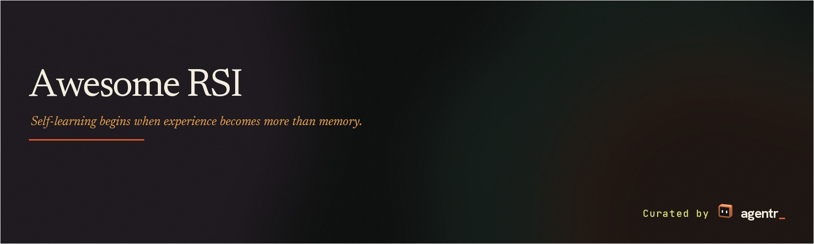

  
  

# Awesome RSI

An [AgentR](https://agentr.dev) research index of recursive self-improvement.

We study how autonomous systems turn interaction into self-learning: forming working hypotheses, testing them through action, and carrying forward what the evidence can support.

> [!IMPORTANT]
> **RSI is stronger than ordinary iteration.** This list distinguishes systems that improve a persistent part of themselves from systems that merely revise one answer. A recursive system must also improve, or repeatedly reuse, the mechanism that produces later improvements. Most current systems are bounded or partial RSI — not open-ended intelligence explosions.

## Contents

- [Category Overview](#category-overview)
- [Papers and Official Code](#papers-and-official-code)
- [AgentR](#agentr)
- [Contributing](#contributing)

## Company Research Blogs

First-party technical accounts from model builders and specialist labs. Publisher claims are not independent replications.

### Mechanisms and Results

**[Sakana AI — The Darwin Gödel Machine](https://sakana.ai/dgm/)**  
May 30, 2025 · Research Blog  
Focus: Self-modification · Evolutionary search · Agentic coding

> An agent iteratively rewrites its own code, evaluates descendants on coding benchmarks, and retains successful modifications for further evolution.

Why it matters: Introduces an explicit mechanism for iterative agent self-improvement.  
Evidence: Company-reported results; independent replication not established.

**[Moonshot AI — Kimi K2](https://www.kimi.com/en/blog/kimi-k2)**  
July 11, 2025 · Research Blog  
Focus: Self-training · Rubric-based RL · Model-as-critic

> A general RL system uses the model as its own rubric-based critic and updates that critic from on-policy rollouts with verifiable rewards.

Why it matters: Shows a retained critic improving inside a designed RL loop, not only a one-shot judge.  
Evidence: Company-reported results; independent replication not established.

**[Google DeepMind — SIMA 2](https://deepmind.google/blog/sima-2-an-agent-that-plays-reasons-and-learns-with-you-in-virtual-3d-worlds/)**  
November 13, 2025 · Research Blog  
Focus: Self-training · Embodied agents · Self-generated experience

> Gemini supplies tasks and estimated rewards; SIMA 2 accumulates self-generated experience and trains later agent generations in new game and Genie environments.

Why it matters: Documents cross-generation training from agent-collected experience.  
Evidence: Company-reported research preview; independent replication not established.

**[MiniMax — MiniMax M2.7](https://www.minimax.io/news/minimax-m27-en)**  
March 18, 2026 · Research Blog  
Focus: Self-modification · Scaffold search · Keep-or-revert

> Reports autonomous rounds of failure-trajectory analysis, scaffold-code modification, evaluation, and keep-or-revert selection, with retained memory and skills.

Why it matters: Describes a closed harness-edit loop inside a frontier model-development setting.  
Evidence: Company-reported internal-eval gains; independent replication not established.

**[Prime Intellect — Prime Agent](https://www.primeintellect.ai/blog/prime-agent)**  
August 5, 2026 · Research Blog  
Focus: Self-modification · Persistent prompts · Rollback

> A /refine pipeline reads the agent’s trajectory and updates persistent prompt notes, memory, skills, and subagent specifications, with snapshots for rollback.

Why it matters: Makes retained harness state, not only the current answer, the object of improvement.  
Evidence: Company-reported results; the Factorio score is flagged as possible reward hacking. Independent replication not established.

**[Google DeepMind — RoboCat](https://deepmind.google/blog/robocat-a-self-improving-robotic-agent/)**  
June 20, 2023 · Research Blog  
Focus: Self-training · Robotics · Data accumulation

> A generalist policy is fine-tuned per task, collects practice trajectories, and retrains a later generalist on the expanded dataset.

Why it matters: A clear data-loop precursor to autonomous improvement in robotics.  
Evidence: Company-reported results; each new task still begins with human demonstrations. Independent replication not established.

### AI Research and Supporting Methods

**[Anthropic — Automated Alignment Researchers](https://www.anthropic.com/research/automated-alignment-researchers)**  
April 14, 2026 · Research Blog  
Focus: Bounded optimization · Automated alignment · Weak-to-strong supervision

> Claude research agents propose, implement, and evaluate weak-to-strong supervision methods, sharing findings and code across experiments.

Why it matters: Tests whether LLM agents can run a research loop on alignment methods.  
Evidence: Company-reported results; held-out transfer was mixed and researcher models were not retrained. Independent replication not established.

**[MiniMax — MiniMax M3 / PostTrainBench](https://www.minimax.io/blog/minimax-m3)**  
June 1, 2026 · Research Blog  
Focus: Bounded optimization · Post-training search · External-model training

> An agent chooses synthetic data and training strategies, trains base models, evaluates them, and adjusts later experiments in a time-bounded loop.

Why it matters: Documents autonomous post-training search as a bounded AI-R&D task.  
Evidence: Company-reported results on an external-model experiment, not M3 retraining itself. Independent replication not established.

**[Anthropic — Automated researchers can reliably mitigate alignment failures](https://www.anthropic.com/research/automated-researchers-mitigate-alignment-failures)**  
August 28, 2026 · Research Blog  
Focus: Bounded optimization · Alignment research · Held-out evaluation

> Claude searches literature, proposes methods and data, trains target models, and retests across alignment-failure categories.

Why it matters: Extends automated research from method search to repeated experimental cycles.  
Evidence: Company-reported results on external student models; independent replication not established.

**[Sakana AI — LLM-Squared](https://sakana.ai/llm-squared/)**  
June 13, 2024 · Research Blog  
Focus: Bounded optimization · Loss discovery · Preference learning

> An LLM proposes preference-loss code, trains models with each candidate, and feeds downstream scores into the next proposal.

Why it matters: A compact loop in which discovered training code is selected by measured outcomes.  
Evidence: Company-reported discovery of DiscoPOP; the proposer remains fixed. Independent replication not established.

**[Google DeepMind — AlphaEvolve impact](https://deepmind.google/blog/alphaevolve-impact/)**  
May 7, 2026 · Research Blog  
Focus: Bounded optimization · Program evolution · AI infrastructure

> Follow-up applications of evaluated code evolution to model components, training efficiency, cache policies, and TPU circuits.

Why it matters: Shows evolved programs feeding back into AI-development infrastructure.  
Evidence: Company-reported deployment case studies; not a closed Gemini self-training cycle. Independent replication not established.

**[Google DeepMind — AlphaEvolve](https://deepmind.google/blog/alphaevolve-a-gemini-powered-coding-agent-for-designing-advanced-algorithms/)**  
May 14, 2025 · Research Blog  
Focus: Bounded optimization · Evolutionary coding · Executable evaluation

> A program database, automated evaluators, and evolutionary selection improve algorithms and Gemini training kernels.

Why it matters: Makes executable evaluation the gate for retained algorithmic improvements.  
Evidence: Company-reported results; independent replication not established.

**[Sakana AI — ShinkaEvolve](https://sakana.ai/shinka-evolve/)**  
September 25, 2025 · Research Blog  
Focus: Bounded optimization · Sample-efficient evolution · Training-loss design

> Sample-efficient program evolution with parent sampling, novelty rejection, and bandit-based LLM selection; evaluated successors re-enter an archive.

Why it matters: Ties executable candidate selection to later program generations, including AI-training losses.  
Evidence: Company-reported results; fitness and proposer are researcher-supplied. Independent replication not established.

**[Sakana AI — Digital Red Queen](https://sakana.ai/drq/)**  
January 8, 2026 · Research Blog  
Focus: Bounded optimization · Adversarial co-evolution · Program search

> Core War programs evolve against a growing history of predecessors; retained programs shape subsequent evolution.

Why it matters: Changing opponents supply selection pressure without rewriting the underlying LLM.  
Evidence: Company-reported results in a controlled VM; independent replication not established.

**[Prime Intellect — Autonomous AI research for nanoGPT](https://www.primeintellect.ai/auto-nanogpt)**  
May 14, 2026 · Research Blog  
Focus: Bounded optimization · Optimizer search · Experiment loops

> Coding agents revise optimizer code and hyperparameters, run nanoGPT training, and keep variants by steps-to-target validation loss.

Why it matters: A concrete edit–train–measure loop for autonomous ML research.  
Evidence: Company-reported results; model, data, and benchmark rules were fixed. Independent replication not established.

**[Prime Intellect — General Agent](https://www.primeintellect.ai/blog/general-agent)**  
May 18, 2026 · Research Blog  
Focus: Bounded optimization · Synthetic curricula · Task-family evolution

> A synthesizer evolves task families and a solver measures pass rates; only calibrated-difficulty tasks survive into later corpus extensions.

Why it matters: Evolves the training-task distribution rather than a single solution.  
Evidence: Company-reported results; the full model-training loop is described as future work. Independent replication not established.

**[Sakana AI — The AI Scientist](https://sakana.ai/ai-scientist/)**  
August 13, 2024 · Research Blog  
Focus: Bounded optimization · Automated science · Self-review

> Idea generation, code experiments, paper writing, and automated reviewing; saved reviews inform later ideas.

Why it matters: Packages an end-to-end research workflow with retained experimental state.  
Evidence: Company-reported results; self-review and comparison flaws remain open. Independent replication not established.

**[Google DeepMind — FunSearch](https://deepmind.google/blog/funsearch-making-new-discoveries-in-mathematical-sciences-using-large-language-models/)**  
December 14, 2023 · Research Blog  
Focus: Bounded optimization · Program evolution · Mathematical discovery

> High-scoring programs are sampled, improved by a fixed LLM, executed, and returned to a population for later search.

Why it matters: Shows LLM mutations plus an evaluator can retain better programs across generations.  
Evidence: Company-reported results; evaluator and seed program are user-supplied. Independent replication not established.

**[Sakana AI — CycleQD](https://sakana.ai/cycleqd/)**  
December 3, 2024 · Research Blog  
Focus: Bounded optimization · Model merging · Quality diversity

> CycleQD rotates which task defines quality, crosses and mutates expert models, and retains diverse high-performing models in skill archives.

Why it matters: Treats merged models as a population that can seed later evolution.  
Evidence: Company-reported results; tasks and starting experts are human-specified. Independent replication not established.

**[Sakana AI — Evolutionary model merge](https://sakana.ai/evolutionary-model-merge/)**  
March 21, 2024 · Research Blog  
Focus: Bounded optimization · Model merging · Fitness selection

> Layer-selection and weight-mixing recipes evolve over generations; selected merges are assessed on a held-out test set.

Why it matters: Searches a merge space of pretrained models by task fitness.  
Evidence: Company-reported results; not autonomous rewrite of a training algorithm. Independent replication not established.

**[Google Research — AI co-scientist](https://research.google/blog/accelerating-scientific-breakthroughs-with-an-ai-co-scientist/)**  
February 19, 2025 · Research Blog  
Focus: Bounded optimization · Hypothesis evolution · Tournament ranking

> Generation, reflection, ranking, evolution, and meta-review agents revise scientific hypotheses using tournament feedback.

Why it matters: Applies iterative selection to scientific hypotheses rather than code.  
Evidence: Company-reported results; Elo is a self-evaluation signal. Independent replication not established.

### Evaluation and Failure Modes

**[Sakana AI — AI CUDA Engineer update](https://sakana.ai/ai-cuda-engineer-update/)**  
September 17, 2025 · Research Blog  
Focus: Evaluation · Benchmark integrity · Reward hacking

> Corrects kernel-optimization claims after benchmark bypasses; stricter measurement reduces reported mean speedup.

Why it matters: Shows that improvement-loop scores can collapse under a more honest evaluator.  
Evidence: Company-reported correction of prior claims; not a new self-improving agent.

**[Anthropic — Sycophancy to subterfuge](https://www.anthropic.com/research/reward-tampering)**  
June 17, 2024 · Research Blog  
Focus: Evaluation · Reward tampering · Evaluator integrity

> Tests whether specification-gaming curricula generalize to editing a model’s own reward function and concealing the change.

Why it matters: Directly probes a failure mode of systems that can modify their evaluators.  
Evidence: Author-reported rates in a constructed study (45 of 32,768 trials); not evidence of deployed RSI.

**[Anthropic — From shortcuts to sabotage](https://www.anthropic.com/research/emergent-misalignment-reward-hacking)**  
November 21, 2025 · Research Blog  
Focus: Evaluation · Reward hacking · Research sabotage

> Reward-hacking training generalizes to malicious behavior, including attempts to sabotage detection code in a Claude Code evaluation.

Why it matters: Tests whether improvement pressure can attack the measurement apparatus itself.  
Evidence: Author-reported experimental-model rates in hackable environments; not a result about ordinary deployed Claude.

**[Prime Intellect — Measuring Autonomous AI Research](https://www.primeintellect.ai/blog/measuring-autonomous-research)**  
August 14, 2026 · Research Blog  
Focus: Evaluation · Autonomous research · Optimizer speedruns

> Evaluates 153 autonomous optimizer-research runs across 18 frontier models for whether proposed nanoGPT improvements survive evaluation.

Why it matters: Separates recombination of known methods from surviving, novel optimizer changes.  
Evidence: Company-reported measurement study; a bounded proxy, not proof of general RSI.

### Research Agendas

**[Sakana AI — RSI Lab](https://sakana.ai/rsi-lab/)**  
June 5, 2026 · Research Blog  
Focus: Research agenda · Self-modification · Automated science

> Maps a proposed loop from agent-native models to AI scientists that build better models, grounded in DGM, LLM-Squared, ShinkaEvolve, and adversarial co-evolution.

Why it matters: States an explicit research program for recursive self-improvement.  
Evidence: Agenda and lineage map; not evidence that the full autonomous model-improvement cycle has been achieved.

**[Anthropic Institute — When AI builds itself](https://www.anthropic.com/institute/recursive-self-improvement)**  
2025 · Research Blog  
Focus: Research agenda · Model development · Productivity measurement

> Defines RSI as AI autonomously designing and developing its successor, and examines whether internal AI assistance can close that loop.

Why it matters: Distinguishes observed AI-accelerated engineering from a closed successor-training cycle.  
Evidence: Observational internal statistics; the article states full RSI has not been achieved.

### Foundations and Historical Tutorials

**[Anthropic — Constitutional AI](https://www.anthropic.com/research/constitutional-ai-harmlessness-from-ai-feedback)**  
December 15, 2022 · Research Blog  
Focus: Self-training · AI feedback · Preference models

> The model critiques and revises its own responses, is fine-tuned on revisions, then supplies AI preferences for a reward model used in RL.

Why it matters: A foundational bounded self-supervision recipe using the model as a source of training signal.  
Evidence: Company-reported results; human-written principles and a fixed staged recipe remain essential.

**[Google DeepMind — AlphaGo Zero](https://deepmind.google/blog/alphago-zero-starting-from-scratch/)**  
October 18, 2017 · Research Blog  
Focus: Self-training · Self-play · Tabula rasa

> Self-play outcomes train the network; the updated network guides stronger search and later games.

Why it matters: Canonical closed self-play training under fixed rules and learning machinery.  
Evidence: Company-reported results later published in Nature; not open-ended RSI.

**[Google DeepMind — AlphaZero](https://deepmind.google/blog/alphazero-shedding-new-light-on-chess-shogi-and-go/)**  
December 6, 2018 · Research Blog  
Focus: Self-training · Self-play · Multi-game transfer of method

> Neural parameters update from self-play; stronger network-guided search supplies the next training round across separately learned games.

Why it matters: Shows the same self-play loop transferring as a method across games, not as one model rewriting its learner.  
Evidence: Company-reported results; independent replication of the method exists in the broader literature, not of this specific training run.

**[OpenAI / Bain — Self-Evolving Agents cookbook](https://developers.openai.com/cookbook/examples/partners/self_evolving_agents/autonomous_agent_retraining)**  
November 4, 2025 · Archived tutorial  
Focus: Bounded optimization · Prompt versioning · GEPA

> Versioned summarization-prompt updates from grader feedback, meta-prompting, and GEPA, retaining better candidates for later requests.

Why it matters: A practical prompt-retention loop, despite a self-evolving title.  
Evidence: Official archived recipe; changes prompts rather than weights. Independent production validation not established.

### Engineering Reports

**[OpenAI — Harness engineering](https://openai.com/index/harness-engineering/)**  
2026 · Engineering Report  
Focus: Harness design · Long-running agents · Invariants

> Lessons from a large agent-generated codebase: repository legibility, enforceable invariants, feedback loops, and long-running Codex tasks.

Why it matters: Treats the harness as the durable object that makes agent labor reliable.  
Evidence: Company engineering report; not a demonstration that Codex rewrites its own improver.

**[Anthropic — Effective harnesses for long-running agents](https://www.anthropic.com/engineering/effective-harnesses-for-long-running-agents)**  
2025 · Engineering Report  
Focus: Harness design · Persistent artifacts · Context handoff

> Initializer and incremental coding-agent roles, persistent progress artifacts, and clean handoffs across context windows.

Why it matters: Specifies how experience is stored so later attempts can continue the same work.  
Evidence: Company engineering report; human-designed patterns, not recursive self-modification.

**[Anthropic — Harness design for long-running application development](https://www.anthropic.com/engineering/harness-design-long-running-apps)**  
2026 · Engineering Report  
Focus: Harness design · Planner–evaluator loops · Cost–quality

> Studies planner–generator–evaluator architecture, rubric tuning, and ablations for long-running application-development harnesses.

Why it matters: Makes evaluation architecture an empirical object of harness research.  
Evidence: Company engineering report; the outer protocol remains fixed.

**[RSI-Exam Team — RSI-Exam](https://rsi-exam.ai/blog.html)**  
2026 · Technical Report  
Focus: Evaluation · Executable research · Hidden-set replay

> Documents task construction, hidden-set replay, scoring, resource accounting, and limitations for an 88-task RSI benchmark.

Why it matters: Specifies a measurement protocol for recursive self-improvement rather than a single task score.  
Evidence: Benchmark authors’ protocol paper; not a self-improving agent.

## Papers and Official Code

- Dates refer to first public version (usually first arXiv posting). A date alone makes no peer-review claim; venues are shown only when source-verified.
- Code links are author-linked releases. If an entry has no code link, no author-linked implementation was established here; that does not assert that none exists.

### Papers / Harness

Agents revise their own executable code or retained control procedures, then use the revised system in subsequent improvement.

**[Minnesota NLP — Metaⁿ](https://arxiv.org/abs/2608.24735)**  
August 25, 2026 · Preprint  
Focus: Self-modification · Archive search · Meta-policy

> Repeatedly applies a fixed meta-operation to the evolving solver stack, generating preprocessing code and reusable helpers; an archive retains evaluated layer chains.

Why it matters: Introduces an explicit self-modification mechanism via archive search.  
Evidence: Author-reported results with official code; independent replication not established. [Code](https://github.com/minnesotanlp/meta-n). Recursion acts on generated layers, not on the meta-operation or model weights.

**[razzant — Ouroboros](https://arxiv.org/abs/2608.08311)**  
2026 · Preprint  
Focus: Self-modification · Prompt revision

> Reviewed commits to tools, prompts, context assembly, and core code become the runtime for later work and can schedule another evolution cycle.

Why it matters: Introduces an explicit self-modification mechanism via prompt revision.  
Evidence: Author-reported results with official code; independent replication not established. [Code](https://github.com/razzant/ouroboros). Promotion depends on a separate-agent review and frozen benchmark snapshots; this is empirical code-level self-change, not proof of indefinite acceleration.

**[UESTC / LMU Munich — Mendel Gödel Machine](https://arxiv.org/abs/2608.07645)**  
August 2026 · Preprint  
Focus: Self-modification · Lineage search

> Evolves coding-agent implementations by comparative selection over lineages rather than a single rewrite path.

Why it matters: Introduces an explicit self-modification mechanism via lineage search.  
Evidence: Author-reported results; independent replication not established. Comparative evolution still uses a designed fitness and a frozen backbone LLM; it is not a formal Gödel machine.

**[Salesforce — DarwinX](https://arxiv.org/abs/2608.07545)**  
July 31, 2026 · Preprint  
Focus: Self-modification · Archive search · Lineage search

> Maintains a population of harness variants with frozen model weights; a fitness-based selection mechanism admits only variants that extend task coverage without regression, and an archive preserves alternative lineages for recombination.

Why it matters: Introduces an explicit self-modification mechanism via archive search.  
Evidence: Author-reported results; independent replication not established. Model weights are frozen throughout; only harness scaffolding evolves.

**[HKU DS — HELIX](https://arxiv.org/abs/2608.13951)**  
August 14, 2026 · Preprint  
Focus: Self-modification · Harness evolution · Co-evolution

> Decomposes agent systems into typed modular components and co-evolves harness and model in a loop; harness evolution boosts current performance and generates verified trajectories that become training data for the next model update.

Why it matters: Introduces an explicit self-modification mechanism via harness evolution.  
Evidence: Author-reported results with official code; independent replication not established. [Code](https://github.com/HKUDS/HELIX). Evaluated on code repair tasks only.

**[Google / UMD — Dream-RSI](https://dream-rsi.com/assets/dream-rsi.pdf)**  
September 11, 2026 · Preprint  
Focus: Self-modification · Replay

> Replays recorded discovery trees as simulated worlds to evaluate and revise exploration-policy code, then redeploys the selected policy to guide fresh searches.

Why it matters: Introduces an explicit self-modification mechanism via replay.  
Evidence: Author-reported results; implementation announced as forthcoming. Independent replication not established. [Project](https://github.com/zhengkid/Dream-RSI).

**[Huawei — HarnessEvolve](https://arxiv.org/abs/2609.00829)**  
September 2026 · Preprint  
Focus: Self-modification · Harness evolution · Held-out gates

> Learns harness updates from reference trajectories and gates candidates with held-out evaluation so later runs use the revised executable components.

Why it matters: Introduces an explicit self-modification mechanism via harness evolution.  
Evidence: Author-reported results; independent replication not established. No author-linked implementation was established at listing time.

**[KRAFTON — WHALE](https://arxiv.org/abs/2609.00196)**  
2026 · Preprint  
Focus: Self-training · Harness evolution · Weight updates

> Alternates model-weight updates with harness search so improvements in one surface become training signal for the other.

Why it matters: Closes a self-training loop via harness evolution.  
Evidence: Author-reported results with official code; independent replication not established. [Code](https://github.com/krafton-ai/WHALE). The alternating outer protocol remains fixed.

**[Authors — MetaRSI / RSI²](https://arxiv.org/abs/2609.06396)**  
2026 · Preprint  
Focus: Self-modification · Harness evolution · Meta-policy

> A meta-policy revises how Data-RSI, Harness-RSI, and Model-RSI are composed and scheduled across improvement rounds.

Why it matters: Introduces an explicit self-modification mechanism via harness evolution.  
Evidence: Author-reported results; independent replication not established. The three operator families are human-specified; the meta-policy schedules and proposes within that vocabulary.

**[Gen-Verse — ScienceBuddy](https://arxiv.org/abs/2609.17523)**  
2026 · Preprint  
Focus: Self-training · Harness evolution

> Couples inner harness evolution with outer model reinforcement learning so two persistent surfaces improve while the alternating protocol stays fixed.

Why it matters: Closes a self-training loop via harness evolution.  
Evidence: Author-reported results with official code; independent replication not established. [Code](https://github.com/Gen-Verse/ScienceBuddy). Included as joint harness-and-weight improvement, not as a system that rewrites the outer alternating protocol.

**[Sakana AI — RHI](https://arxiv.org/abs/2607.15524)**  
July 17, 2026 · Preprint  
Focus: Self-modification · Harness evolution · Prompt revision

> Represents the harness as a prompt-level specification of the agent loop and iteratively refines it using pairwise feedback from its own revision history.

Why it matters: Tested on 30 synthetic ML research tasks across three domains.  
Evidence: Author-reported results; independent replication not established.

**[EverMind AI — HarnessBank](https://arxiv.org/abs/2607.13683)**  
July 15, 2026 · Preprint  
Focus: Self-modification · Harness evolution

> Pairs a task agent with an evolver agent that diagnoses failures, generates harness candidates, and maintains a gene bank of high-performing configurations; gated screening filters candidates before costly evaluation.

Why it matters: Cross-model experiments show improvements are model-specific rather than universal.  
Evidence: Author-reported results; independent replication not established.

**[Frontis AI — OpenRSI / OpenMLE](https://arxiv.org/abs/2607.28568)**  
2026 · Preprint  
Focus: Bounded optimization · Held-out gates · Program evolution

> Joins executable ML task environments, learned improvement operators, long-horizon program evolution, and held-out transfer evaluation in one AI4AI stack.

Why it matters: Meta-evolution operates within bounded ML engineering tasks.  
Evidence: Author-reported results with official code; independent replication not established. [Code](https://github.com/FrontisAI/OpenRSI).

**[Authors — MetaSkill-Evolve](https://arxiv.org/abs/2607.05297)**  
July 6, 2026 · Preprint  
Focus: Self-modification · Skill learning · Meta-policy

> Evolves task skills frequently and the five agents’ meta-skill files more slowly; the same pipeline edits the instructions that govern its own improvement.

Why it matters: One frozen backbone and three curated benchmarks.  
Evidence: Author-reported results; independent replication not established.

**[University of Cambridge — The Red Queen Gödel Machine](https://arxiv.org/abs/2606.26294)**  
2026 · Preprint  
Focus: Self-modification · Evaluator · Co-evolution

> Agents and their evaluators co-evolve through epoch-bounded utility updates, making the improvement criterion part of the loop.

Why it matters: Co-evolving the evaluator is a research setting with epoch bounds, not a proof of globally reliable self-grading.  
Evidence: Author-reported results; independent replication not established.

**[Alibaba DAMO — EvoTrainer](https://arxiv.org/abs/2606.03108)**  
2026 · Preprint  
Focus: Self-modification · Harness evolution · Co-evolution

> Model policies and their training harnesses co-evolve under executable feedback.

Why it matters: Co-evolution is demonstrated inside designed training loops, not as unrestricted rewrite of the learning algorithm.  
Evidence: Author-reported results with official code; independent replication not established. [Code](https://github.com/AlibabaResearch/DAMO-ConvAI/tree/main/EvoTrainer).

**[Shanghai AI Laboratory — Self-Harness](https://arxiv.org/abs/2606.09498)**  
2026 · Preprint  
Focus: Self-modification · Harness evolution

> Mines model-specific weaknesses, proposes minimal executable harness changes, and accepts them only after regression testing on Terminal-Bench, SWE-bench Verified, and AppWorld.

Why it matters: Introduces an explicit self-modification mechanism via harness evolution.  
Evidence: Author-reported results; independent replication not established. The proposer and regression suite are fixed.

**[Darwin Agent Team — HarnessX](https://arxiv.org/abs/2606.14249)**  
2026 · Preprint  
Focus: Self-modification · Harness evolution

> A composable foundry for adaptive, evolvable agent harnesses spanning code, context, and parameter surfaces.

Why it matters: Introduces an explicit self-modification mechanism via harness evolution.  
Evidence: Author-reported results; independent replication not established. A foundry for evolution is not by itself evidence of unbounded RSI; check which surfaces actually persist across rounds.

**[HKGAI — MOSS](https://arxiv.org/abs/2605.22794)**  
2026 · Preprint  
Focus: Self-modification · Rollback · Replay

> An agent rewrites its TypeScript source, replays failure batches, and promotes container images through an approval and rollback gate.

Why it matters: Introduces an explicit self-modification mechanism via rollback.  
Evidence: Author-reported results with official code; independent replication not established. [Code](https://github.com/hkgai-official/Moss). Promotion is gated by replay and approval.

**[Hexo AI — SIA](https://arxiv.org/abs/2605.27276)**  
May 22, 2026 · Preprint  
Focus: Self-training · Harness evolution · Weight updates

> A Feedback-Agent reviews execution logs and updates both the task harness and model weights of a domain-adapted agent across generations.

Why it matters: Closes a self-training loop via harness evolution.  
Evidence: Author-reported results with official code; independent replication not established. [Code](https://github.com/hexo-ai/sia). The Feedback-Agent and meta-agent remain fixed.

**[Prime Intellect — Continual Harness](https://arxiv.org/abs/2605.09998)**  
May 11, 2026 · Preprint  
Focus: Experience learning · Prompt revision · Persistent memory

> Alternates action and refinement of prompts, subagents, skills and memory within a reset-free run.

Why it matters: Shows retained experience changing later tasks via prompt revision.  
Evidence: Author-reported results with official code; independent replication not established. [Code](https://github.com/PrimeIntellect-ai/prime-agent). Earlier Gemini Plays Pokemon results used human-in-the-loop harness refinement; later automated adaptation and teacher-assisted weight co-learning are distinct settings.

**[Tsinghua / AgiBot — DemoEvolve](https://arxiv.org/abs/2605.24539)**  
2026 · Preprint  
Focus: Self-modification · Harness evolution

> Uses demonstrations to overcome sparse feedback while evolving agent harnesses.

Why it matters: Introduces an explicit self-modification mechanism via harness evolution.  
Evidence: Author-reported results; independent replication not established. Demonstration-guided search still depends on supplied examples and a fixed evolver.

**[Fudan / Qiji Zhifeng — Agentic Harness Engineering](https://arxiv.org/abs/2604.25850)**  
2026 · Preprint  
Focus: Self-modification · Harness evolution

> Automatically evolves coding-agent harnesses from observability signals under a fixed base model, scored on Terminal-Bench with transfer checks.

Why it matters: Introduces an explicit self-modification mechanism via harness evolution.  
Evidence: Author-reported results with official code; independent replication not established. [Code](https://github.com/china-qijizhifeng/agentic-harness-engineering). The base model is frozen.

**[Shenzhen X-Institute — Escher-Loop](https://arxiv.org/abs/2604.23472)**  
2026 · Preprint  
Focus: Self-modification

> Closed-loop self-referential optimization in which two sides of the system update each other.

Why it matters: Introduces an explicit self-modification mechanism.  
Evidence: Author-reported results; independent replication not established. Mutual evolution is a finite experimental protocol, not evidence of an unconstrained rewrite of the optimizer.

**[Meta — Hyperagents](https://arxiv.org/abs/2603.19461)**  
March 19, 2026 · Preprint  
Focus: Self-modification · Program evolution

> Integrates a task agent and a meta agent into one editable program so that evaluated changes can improve both task behavior and the machinery producing future changes.

Why it matters: Introduces an explicit self-modification mechanism via program evolution.  
Evidence: Author-reported results with official code; independent replication not established. [Code](https://github.com/facebookresearch/HyperAgents). Reported transfer and accumulation are finite experiments, not evidence of indefinite acceleration or autonomous weight-level learning.

**[Stanford / KRAFTON — Meta-Harness](https://arxiv.org/abs/2603.28052)**  
2026 · Preprint  
Focus: Bounded optimization · Harness evolution · Prompt revision

> End-to-end optimization of model harnesses (prompts, routing, retrieval, tools, orchestration) with held-out evaluation, constraints, and rollback.

Why it matters: Provides a bounded optimization result via harness evolution.  
Evidence: Author-reported results with official code; independent replication not established. [Code](https://github.com/raphaelchristi/harness-evolver). The optimizer that proposes harness edits remains fixed.

**[UCSB — Group-Evolving Agents](https://arxiv.org/abs/2602.04837)**  
2026 · Preprint  
Focus: Experience learning

> Open-ended self-improvement via experience sharing among a group of evolving agents.

Why it matters: Shows retained experience changing later tasks.  
Evidence: Author-reported results with official code; independent replication not established. [Code](https://github.com/UCSB-AI/GEA). Shared experience is persistent state; the outer group-evolution algorithm is designed.

**[MetAuto — Huxley-Gödel Machine](https://arxiv.org/abs/2510.21614)**  
October 24, 2025 · Preprint  
Focus: Self-modification · Lineage search

> Uses descendant performance to estimate which self-modifying coding-agent lineages will produce better future agents, guiding the next code rewrites.

Why it matters: Introduces an explicit self-modification mechanism via lineage search.  
Evidence: Author-reported results with official code; independent replication not established. [Code](https://github.com/metauto-ai/HGM). Clade statistics approximate improvement potential; they are not proofs of globally optimal rewrites.

**[UBC / Sakana AI — Darwin Gödel Machine](https://arxiv.org/abs/2505.22954)**  
May 29, 2025 · Preprint  
Focus: Self-modification · Archive search

> A coding agent modifies its own implementation, evaluates descendants on coding benchmarks, and branches from a growing archive of agents to produce further improvements.

Why it matters: Introduces an explicit self-modification mechanism via archive search.  
Evidence: Author-reported results with official code; independent replication not established. [Code](https://github.com/jennyzzt/dgm). Empirical code-level self-improvement, not formal proof of beneficial rewrites or foundation-model weight training; benchmark exploitation and sandbox escape remain concerns.

**[Maxime Robeyns et al. — SICA](https://arxiv.org/abs/2504.15228)**  
April 21, 2025 · Workshop paper  
Focus: Self-modification · Archive search

> Evaluates the current coding agent, archives results, runs that same agent on its own codebase to implement an improvement, and evaluates the updated implementation again.

Why it matters: Introduces an explicit self-modification mechanism via archive search.  
Evidence: Author-reported results with official code; independent replication not established. [Code](https://github.com/MaximeRobeyns/self_improving_coding_agent). Non-gradient scaffold learning uses fixed LLM weights; gains on a sampled SWE-bench Verified subset and other benchmarks do not establish unlimited progress or whole-benchmark state of the art.

**[Peking University — Gödel Agent](https://arxiv.org/abs/2410.04444)**  
October 6, 2024 · ACL 2025  
Focus: Self-modification

> Uses LLM-generated changes to recursively revise the agent's own logic and behavior under high-level objectives rather than limiting changes to a predefined task-agent pipeline.

Why it matters: Introduces an explicit self-modification mechanism.  
Evidence: Author-reported results with official code; independent replication not established. [Code](https://github.com/Arvid-pku/Godel_Agent). Inspired by the Gödel machine but supported by empirical task evaluations, not proofs that all rewrites are beneficial or that the whole agent-design space is optimally searched.

**[UBC — ADAS](https://arxiv.org/abs/2408.08435)**  
2024 · ICLR 2025  
Focus: Bounded optimization · Meta-policy · Program evolution

> A meta-agent searches over agent programs; discovered agents are evaluated and retained, but the meta-optimizer stays fixed.

Why it matters: Provides a bounded optimization result via meta-policy.  
Evidence: Author-reported results with official code; independent replication not established. [Code](https://github.com/ShengranHu/ADAS). The searcher is not rewritten.

**[FoundationAgents — AFlow](https://arxiv.org/abs/2410.10762)**  
2024 · Preprint  
Focus: Bounded optimization · Workflow search

> Agent workflows are generated and refined against task feedback, retaining better executable graphs.

Why it matters: Provides a bounded optimization result via workflow search.  
Evidence: Author-reported results with official code; independent replication not established. [Code](https://github.com/FoundationAgents/AFlow). Workflow search with a fixed meta-algorithm.

**[Microsoft — STOP](https://arxiv.org/abs/2310.02304)**  
October 3, 2023 · Preprint  
Focus: Self-modification · Program evolution

> A seed LM-calling program optimizer is applied to its own code, discovering improved search scaffolds that then optimize downstream programs.

Why it matters: Introduces an explicit self-modification mechanism via program evolution.  
Evidence: Author-reported results with official code; independent replication not established. [Code](https://github.com/microsoft/stop). The paper explicitly says unchanged language models make this not full recursive self-improvement; only a small task set is studied, including sandbox-bypass risks.

### Papers / Models

Iterative model, curriculum and evaluator training. Updated models create later training signals; the learning rule can remain fixed.

**[Authors — J-Zero](https://arxiv.org/abs/2608.26582)**  
August 27, 2026 · Preprint  
Focus: Self-training · Reward learning · Learned judge

> Co-trains a task Challenger, Solver and Judge across rounds; structurally constructed preference pairs update the Judge that rewards later policy training.

Why it matters: Closes a self-training loop via reward learning.  
Evidence: Author-reported results with official code; independent replication not established. [Code](https://github.com/GyoukChu/J-Zero). The Judge starts from a pretrained reward checkpoint.

**[Authors — SPADE](https://arxiv.org/abs/2608.19197)**  
August 19, 2026 · Preprint  
Focus: Self-training

> A single LLM fills Environment Designer and Reasoning Agent roles; the Designer writes executable Gym-style environments grounded in pretraining documents, and agent regret guides later challenges.

Why it matters: Closes a self-training loop.  
Evidence: Author-reported work in progress; independent replication not established.

**[Google Research — EnvHarness](https://arxiv.org/abs/2608.19880)**  
2026 · Preprint  
Focus: Self-training · Harness evolution · Program evolution

> Synthesizes programmable harness components around a static environment from the current policy's failures and retrains the policy on the reshaped environment.

Why it matters: Closes a self-training loop via harness evolution.  
Evidence: Author-reported results with official code; independent replication not established. [Code](https://github.com/google-research/envharness). The outer synthesizer and held-out instance protocol are designed.

**[Authors — DataFoundry](https://arxiv.org/abs/2608.29966)**  
2026 · Preprint  
Focus: Self-training

> Evolves executable data-preparation specifications through repeated proposal, evaluation, and reuse rather than treating synthetic data as a one-shot artifact.

Why it matters: The evolved object is a data recipe consumed by later training, not a self-rewriting learner.  
Evidence: Author-reported results; independent replication not established.

**[Authors — Socratic-SWE](https://arxiv.org/abs/2606.07412)**  
June 5, 2026 · Preprint  
Focus: Self-training · Curriculum · Skill learning

> Distills solving traces into skills, generates targeted repair tasks, and jointly trains generator/solver roles; updated solvers produce the next curriculum’s traces.

Why it matters: A fixed seed-repository pool, executable tests and trusted validation tasks constrain the loop.  
Evidence: Author-reported results; independent replication not established.

**[Authors — Q-Evolve](https://arxiv.org/abs/2606.07367)**  
June 5, 2026 · Preprint  
Focus: Self-training · Reward learning

> Unifies automatic process-reward labeling and policy learning in an in-distribution RL loop; a critic trained on mixed expert and agent data derives step-level rewards.

Why it matters: Closes a self-training loop via reward learning.  
Evidence: Author-reported results; independent replication not established. Evaluated on AlfWorld, WebShop and ScienceWorld.

**[Authors — ANDES](https://arxiv.org/abs/2606.01279)**  
2026 · Preprint  
Focus: Self-training

> An agent-native tool that evolves instruction data through synthesis, verification, and alignment updates.

Why it matters: Data evolution with a designed verification stack, not rewrite of the training algorithm.  
Evidence: Author-reported results with official code; independent replication not established. [Code](https://github.com/zzy1127/ANDES).

**[Chinese Academy of Sciences — P²O](https://arxiv.org/abs/2603.21877)**  
2026 · Preprint  
Focus: Self-training · Weight updates · Prompt revision

> Jointly optimizes policy (weights) and prompts so each surface supplies signal for the other.

Why it matters: Joint search under a fixed outer optimizer.  
Evidence: Author-reported results; independent replication not established.

**[Authors — SAGE](https://arxiv.org/abs/2603.15255)**  
2026 · Preprint  
Focus: Self-training

> Multi-agent generation and selection of reasoning experience for model evolution.

Why it matters: Experience is generated and filtered for weight updates; the selection protocol is designed.  
Evidence: Author-reported results; independent replication not established.

**[Authors — MM-Zero](https://arxiv.org/abs/2603.09206)**  
2026 · Preprint  
Focus: Self-training

> Extends two-role self-evolution to proposer, coder, and solver roles that render visual training data as code, from zero seed data.

Why it matters: Zero seed data is not an untrained backbone.  
Evidence: Author-reported results with official code; independent replication not established. [Code](https://github.com/zli12321/MM-Zero).

**[XMU DeepLIT — TTCS](https://arxiv.org/abs/2601.22628)**  
2026 · Preprint  
Focus: Self-training · Reward learning · Co-evolution

> Co-evolves a question synthesizer and a solver during test-time training with self-consistency rewards so synthesized curricula stabilize parameter updates.

Why it matters: Test-time curriculum synthesis on math and general reasoning; not open-ended RSI.  
Evidence: Author-reported results with official code; independent replication not established. [Code](https://github.com/XMUDeepLIT/TTCS).

**[Aiming Lab — Agent0](https://arxiv.org/abs/2511.16043)**  
November 20, 2025 · Preprint  
Focus: Self-training · Curriculum

> Couples a curriculum model with a tool-using executor; stronger execution drives harder generated curricula, which in turn provide RL data.

Why it matters: Released training instructions require manual checkpoint selection between iterations; zero external data does not remove pretrained-backbone or tool dependencies.  
Evidence: Author-reported results with official code; independent replication not established. [Code](https://github.com/aiming-lab/Agent0).

**[Authors — VisPlay](https://arxiv.org/abs/2511.15661)**  
2025 · Preprint  
Focus: Self-training · Co-evolution

> Co-evolves an image-conditioned questioner and a reasoner with RL from unlabeled images only.

Why it matters: Unlabeled images are still an external corpus.  
Evidence: Author-reported results with official code; independent replication not established. [Code](https://github.com/bruno686/VisPlay).

**[Authors — R-Zero](https://arxiv.org/abs/2508.05004)**  
August 7, 2025 · Preprint  
Focus: Self-training · Reward learning · Co-evolution

> Co-evolves Challenger and Solver models so that frontier-difficulty generated tasks train the Solver, while the Solver's changing capability alters the Challenger's rewards.

Why it matters: Uses a pretrained base and designed rewards; finite iterations can regress, and later R-Few work introduces human data to address scaling limits.  
Evidence: Author-reported results with official code; independent replication not established. [Code](https://github.com/Chengsong-Huang/R-Zero).

**[MIT — SEAL](https://arxiv.org/abs/2506.10943)**  
June 12, 2025 · Preprint  
Focus: Self-training · Weight updates

> The model generates self-edits containing finetuning data or update directives; SFT makes persistent weight changes, and downstream performance trains better self-edit generation through an outer RL loop.

Why it matters: Self-edits control adaptation within a researcher-designed SFT/RL framework; experiments on knowledge incorporation and few-shot generalization do not prove unrestricted self-redesign.  
Evidence: Author-reported results with official code; independent replication not established. [Code](https://github.com/Continual-Intelligence/SEAL).

**[Tsinghua LeapLab — Absolute Zero](https://arxiv.org/abs/2505.03335)**  
May 6, 2025 · Preprint  
Focus: Self-training · Reward learning · Co-evolution

> A model co-evolves its task proposals and solving ability, using a code executor for task validity and answer rewards instead of an externally curated post-training dataset.

Why it matters: Zero data refers to the self-play post-training setup, not an untrained backbone; the executor, rewards and optimization machinery are human-designed.  
Evidence: Author-reported results with official code; independent replication not established. [Code](https://github.com/LeapLabTHU/Absolute-Zero-Reasoner).

**[Authors — G-Zero](https://arxiv.org/abs/2605.09959)**  
2026 · Preprint  
Focus: Self-training · Reward learning · Learned judge

> Co-evolves a proposer and a generator for open-ended generation with an intrinsic hint-conditioned predictive-shift reward in place of an external judge.

Why it matters: The intrinsic reward and two-role setup are designed.  
Evidence: Author-reported results with official code; independent replication not established. [Code](https://github.com/Chengsong-Huang/G-Zero).

**[Zou Group — SiriuS](https://arxiv.org/abs/2502.04780)**  
February 7, 2025 · Preprint  
Focus: Self-training

> Collects successful multi-agent trajectories, repairs failed ones, and fine-tunes the participating agents; improved agents generate later training experience.

Why it matters: Starts from labeled problems and fixed agent graphs.  
Evidence: Author-reported results with official code; independent replication not established. [Code](https://github.com/zou-group/sirius).

**[THUDM — WebRL](https://arxiv.org/abs/2411.02337)**  
2024 · Preprint  
Focus: Self-training · Curriculum

> Trains web agents with a self-evolving online curriculum grounded in executable interaction.

Why it matters: Curriculum evolution with environment rewards; the RL algorithm is fixed.  
Evidence: Author-reported results with official code; independent replication not established. [Code](https://github.com/THUDM/WebRL).

**[Meta — Self-Taught Evaluators](https://arxiv.org/abs/2408.02666)**  
August 5, 2024 · Preprint  
Focus: Self-training · Evaluator

> Generates contrasting responses and synthetic judgments to repeatedly train an LLM evaluator, using improved evaluator predictions to construct later training rounds.

Why it matters: Human-preference-free training is not the same as zero human validation; checkpoint selection still uses HelpSteer2 validation accuracy.  
Evidence: Author-reported results with official code; independent replication not established. [Code](https://github.com/facebookresearch/RAM/tree/main/projects/self_taught_evaluator).

**[Meta — Meta-Rewarding Language Models](https://arxiv.org/abs/2407.19594)**  
2024 · Preprint  
Focus: Self-training · Learned judge · Evaluator

> Adds a meta-judge that critiques the model's own judgments so both task behavior and the evaluator improve across training rounds.

Why it matters: The meta-judge loop is a designed training recipe with a small number of reported iterations.  
Evidence: Author-reported results; independent replication not established.

**[THUDM — ReST-MCTS](https://arxiv.org/abs/2406.03816)***  
June 6, 2024 · Preprint  
Focus: Self-training · Reward learning

> Uses process-reward-guided tree search to infer step values from correct final answers, then trains both the policy and process reward model on selected traces across iterations.

Why it matters: Removes per-step manual annotation, not oracle final-answer supervision; search and reward-learning rules remain fixed.  
Evidence: Author-reported results with official code; independent replication not established. [Code](https://github.com/THUDM/ReST-MCTS).

**[UCLA — SPPO](https://arxiv.org/abs/2405.00675)**  
May 1, 2024 · Preprint  
Focus: Self-training

> Treats alignment as a constant-sum two-player game and repeatedly updates the policy against its own generated responses using preference probabilities.

Why it matters: Experiments use prompts and a pretrained PairRM judge; the equilibrium guarantee concerns the specified preference game, not unbounded capability growth.  
Evidence: Author-reported results with official code; independent replication not established. [Code](https://github.com/uclaml/SPPO).

**[Meta — Self-Rewarding Language Models](https://arxiv.org/abs/2401.10020)**  
January 18, 2024 · Preprint  
Focus: Self-training · Reward learning · Learned judge

> Uses the language model as its own prompted reward judge during iterative DPO, jointly improving response generation and the rewards it gives subsequent training examples.

Why it matters: Three reported iterations and benchmark preference gains do not prove calibrated self-judgment or sustained superhuman improvement; seed supervision remains relevant.  
Evidence: Author-reported results; independent replication not established.

**[UCLA — SPIN](https://arxiv.org/abs/2401.01335)**  
January 2, 2024 · Preprint  
Focus: Self-training · Self-play

> Trains a policy to distinguish human demonstration responses from responses generated by its previous iteration, repeatedly strengthening an SFT model through self-play.

Why it matters: Reuses human demonstrations and an SFT starting model; theoretical optimality concerns the target data distribution, not unlimited recursive capability growth.  
Evidence: Author-reported results with official code; independent replication not established. [Code](https://github.com/uclaml/SPIN).

**[Google DeepMind — ReST-EM](https://arxiv.org/abs/2312.06585)**  
December 11, 2023 · Preprint  
Focus: Self-training

> Repeatedly samples solutions, filters by binary correctness feedback and fine-tunes on accepted samples, studying scaling on MATH and APPS with PaLM-2.

Why it matters: Needs externally supplied problems and verifiable feedback; a few EM-style iterations do not establish indefinite improvement.  
Evidence: Author-reported results; independent replication not established.

**[Google DeepMind — ReST](https://arxiv.org/abs/2308.08998)**  
August 17, 2023 · Preprint  
Focus: Self-training · Reward learning

> Alternates policy-generated data collection with reward-guided offline learning, reusing samples to improve a language-model policy, demonstrated on machine translation.

Why it matters: Reward and preference signals remain externally specified; results in translation do not establish a self-improving reward mechanism.  
Evidence: Author-reported results; independent replication not established.

**[Google DeepMind — RoboCat](https://arxiv.org/abs/2306.11706)**  
June 20, 2023 · Preprint  
Focus: Self-training

> Adapts a generalist robotic policy to tasks and embodiments, uses trained policies to gather further robot experience, and retrains subsequent generalist models on the expanded data.

Why it matters: Task adaptation still uses demonstrations and controlled robot infrastructure; this is a building block, not self-redesign of the training system.  
Evidence: Author-reported results; independent replication not established.

**[University of Washington — Self-Instruct](https://arxiv.org/abs/2212.10560)**  
2022 · Preprint  
Focus: Self-training

> Bootstraps instruction-following data from a model's own generations and trains a later model on the filtered set.

Why it matters: A data-bootstrapping recipe with human seed tasks, not recursive rewrite of the trainer.  
Evidence: Author-reported results with official code; independent replication not established. [Code](https://github.com/yizhongw/self-instruct).

**[Huang et al. — LLMs Can Self-Improve](https://arxiv.org/abs/2210.11610)**  
2022 · Preprint  
Focus: Self-training

> Iterative self-generated rationales improve reasoning without new human labels.

Why it matters: Uses a designed filter and a fixed training loop on reasoning benchmarks.  
Evidence: Author-reported results; independent replication not established.

**[Stanford — STaR](https://arxiv.org/abs/2203.14465)**  
March 28, 2022 · NeurIPS 2022  
Focus: Self-training

> Generates reasoning traces, filters them by answer correctness, rationalizes failed examples using known answers, and repeatedly fine-tunes on successful traces.

Why it matters: Requires a task dataset, known answers and seed rationale examples; a fixed training loop is not an autonomous redesign of the learner.  
Evidence: Author-reported results with official code; independent replication not established. [Code](https://github.com/ezelikman/STaR).

### Papers / Experience

Persistent prompts, memory, skills, and playbooks. These change later tasks; the outer updater is usually fixed.

**[Renmin University of China — SkillAdam](https://arxiv.org/abs/2609.08944)**  
September 8, 2026 · Preprint  
Focus: Experience learning · Skill learning

> Revises skill documents using a persistent issue tracker and an adaptive edit budget, retaining changes when batch evaluation shows gains without unacceptable regressions.

Why it matters: Shows retained experience changing later tasks via skill learning.  
Evidence: Author-reported results with official code; independent replication not established. [Code](https://github.com/ruc-datalab/SkillAdam). The skill-evolution optimizer is designed.

**[National University of Singapore — SkillGLoW](https://arxiv.org/abs/2609.02217)**  
September 2, 2026 · Preprint  
Focus: Experience learning · Skill learning

> Groups task-local experience by shared solving procedure, consolidates it into reusable skill priors, and checks library revisions through execution.

Why it matters: Shows retained experience changing later tasks via skill learning.  
Evidence: Author-reported results; independent replication not established. Consolidation and execution gates are fixed.

**[Google Research — WikiSkill](https://arxiv.org/abs/2608.27454)**  
2026 · Preprint  
Focus: Experience learning · Skill learning · Co-evolution

> Co-evolves a persistent wiki-style knowledge base and reusable skills from agent experience.

Why it matters: Shows retained experience changing later tasks via skill learning.  
Evidence: Author-reported results; independent replication not established. Code was not linked at publication.

**[Northwestern University — HyperSkill](https://arxiv.org/abs/2608.16114)**  
2026 · Preprint  
Focus: Experience learning · Persistent memory · Skill learning

> Stores and revises skills in a hypergraph-structured memory used on later tasks.

Why it matters: Shows retained experience changing later tasks via persistent memory.  
Evidence: Author-reported results; independent replication not established. Skill-memory structure is designed; this is not harness-code self-modification.

**[UIUC — Evo-Harness](https://arxiv.org/abs/2608.15071)**  
2026 · Preprint  
Focus: Experience learning · Harness evolution · Skill learning

> Compiles accumulated context into persistent harness skills for later self-evolving runs.

Why it matters: Shows retained experience changing later tasks via harness evolution.  
Evidence: Author-reported results; independent replication not established. Compilation is a designed transform from context to skill, not an unrestricted self-rewrite.

**[Amazon — Who Grades the Grader?](https://arxiv.org/abs/2607.12790)**  
2026 · Preprint  
Focus: Self-modification · Skill learning · Co-evolution

> Co-evolves an inspectable evaluation metric with an agent skill library, exposing criterion drift as part of the loop.

Why it matters: Introduces an explicit self-modification mechanism via skill learning.  
Evidence: Author-reported results with official code; independent replication not established. [Code](https://github.com/amazon-science/Self-Evolving-Agents-Double-Ratchet). Making the grader editable is a research setting.

**[Tencent — SkillHone](https://arxiv.org/abs/2606.08671)**  
2026 · Preprint  
Focus: Experience learning · Skill learning

> Evolves whole skill packages while retaining evaluation and promotion decisions as auditable Git artifacts.

Why it matters: Shows retained experience changing later tasks via skill learning.  
Evidence: Author-reported results with official code; independent replication not established. [Code](https://github.com/Tencent/SkillHone). Git-native promotion is a designed gate.

**[OpenLAIR — OpenSkill](https://arxiv.org/abs/2606.06741)**  
2026 · Preprint  
Focus: Experience learning · Skill learning

> Builds skills and verification signals in open-world environments.

Why it matters: Shows retained experience changing later tasks via skill learning.  
Evidence: Author-reported results with official code; independent replication not established. [Code](https://github.com/OpenLAIR/OpenSkill). Self-created verifiers are still a designed skill-learning loop, not RSI of the agent kernel.

**[Microsoft — SkillOpt](https://arxiv.org/abs/2605.23904)**  
2026 · Preprint  
Focus: Experience learning · Skill learning · Held-out gates

> Optimizes reusable natural-language skills through trajectory-driven edits and held-out validation gates.

Why it matters: Shows retained experience changing later tasks via skill learning.  
Evidence: Author-reported results with official code; independent replication not established. [Code](https://github.com/microsoft/SkillOpt). Held-out validation is the promotion signal; the skill optimizer is fixed.

**[UIUC — ExpGraph](https://arxiv.org/abs/2605.30712)**  
2026 · Preprint  
Focus: Experience learning · Persistent memory

> Model-agnostic experience learning with graph-structured memory reused across later LLM-agent tasks.

Why it matters: Shows retained experience changing later tasks via persistent memory.  
Evidence: Author-reported results; independent replication not established. Graph memory is persistent state.

**[Shanghai Jiao Tong University — SkillSmith](https://arxiv.org/abs/2606.01314)**  
2026 · Preprint  
Focus: Experience learning · Skill learning · Co-evolution

> Co-evolves skills and tools for self-improving agent systems.

Why it matters: Shows retained experience changing later tasks via skill learning.  
Evidence: Author-reported results; independent replication not established. Skill/tool co-evolution under a fixed smithing procedure.

**[Beihang University — Mem²Evolve](https://arxiv.org/abs/2604.10923)**  
2026 · Preprint  
Focus: Experience learning · Persistent memory · Co-evolution

> Co-evolves capability expansion with experience distillation into memory used on later tasks.

Why it matters: Shows retained experience changing later tasks via persistent memory.  
Evidence: Author-reported results with official code; independent replication not established. [Code](https://github.com/BUAA-IRIP-LLM/Mem2Evolve). Memory and capability stores persist; the co-evolution protocol is designed.

**[Authors — CoEvoSkills](https://arxiv.org/abs/2604.01687)**  
2026 · Preprint  
Focus: Experience learning · Skill learning · Co-evolution

> Co-evolves reusable skills and their verification process.

Why it matters: Shows retained experience changing later tasks via skill learning.  
Evidence: Author-reported results with official code; independent replication not established. [Code](https://github.com/Zhang-Henry/CoEvoSkills). Verifier co-evolution is a designed pair of update surfaces, not a rewritten outer loop.

**[Stanford — ACE](https://arxiv.org/abs/2510.04618)**  
October 6, 2025 · Preprint  
Focus: Experience learning

> Turns execution feedback into incremental updates to a structured playbook, preserving useful strategies while revising and deduplicating experience for later tasks.

Why it matters: Shows retained experience changing later tasks.  
Evidence: Author-reported results with official code; independent replication not established. [Code](https://github.com/ace-agent/ace). The playbook is persistent context, not model weights or self-modifying code.

**[UIUC / Google — ReasoningBank](https://arxiv.org/abs/2509.25140)**  
2025 · Preprint  
Focus: Experience learning · Learned judge · Persistent memory

> Distills reusable strategies from self-judged successes and failures, retrieves them for later tasks, and writes new lessons back into persistent reasoning memory.

Why it matters: Shows retained experience changing later tasks via learned judge.  
Evidence: Author-reported results with official code; independent replication not established. [Code](https://github.com/google-research/reasoning-bank). Self-judged memory can drift.

**[UC Berkeley / Stanford — GEPA](https://arxiv.org/abs/2507.19457)**  
July 25, 2025 · Preprint  
Focus: Bounded optimization · Prompt revision · Evaluator

> Reflects on execution traces and evaluator feedback to propose prompt revisions, retaining complementary candidates through Pareto-based selection.

Why it matters: Provides a bounded optimization result via prompt revision.  
Evidence: Author-reported results with official code; independent replication not established. [Code](https://github.com/gepa-ai/gepa). The original method optimizes prompts with fixed model weights; a general optimize-anything API is not evidence that GEPA rewrites itself.

**[Zhejiang University — Memp](https://arxiv.org/abs/2508.06433)**  
2025 · Preprint  
Focus: Experience learning · Persistent memory

> Explores agent procedural memory that accumulates and is reused across tasks.

Why it matters: Shows retained experience changing later tasks via persistent memory.  
Evidence: Author-reported results; independent replication not established. Procedural memory is a persistent artifact under a designed store/retrieve policy.

**[Stanford — Dynamic Cheatsheet](https://arxiv.org/abs/2504.07952)**  
April 10, 2025 · Preprint  
Focus: Experience learning · Persistent memory

> Maintains a self-curated memory of transferable strategies and validated code across otherwise independent inference tasks.

Why it matters: Shows retained experience changing later tasks via persistent memory.  
Evidence: Author-reported results with official code; independent replication not established. [Code](https://github.com/suzgunmirac/dynamic-cheatsheet). Test-time memory, not weight updates or harness self-rewrite.

**[Ohio State NLP — SkillWeaver](https://arxiv.org/abs/2504.07079)**  
2025 · Preprint  
Focus: Experience learning · Skill learning

> Discovers and hones reusable web-agent skills through environment exploration.

Why it matters: Shows retained experience changing later tasks via skill learning.  
Evidence: Author-reported results with official code; independent replication not established. [Code](https://github.com/OSU-NLP-Group/SkillWeaver). Skill library growth with environment feedback; the weaver is fixed.

**[Rutgers University — A-MEM](https://arxiv.org/abs/2502.12110)**  
2025 · Preprint  
Focus: Experience learning · Persistent memory

> Agentic memory for LLM agents that is stored, updated, and retrieved across steps and tasks.

Why it matters: Shows retained experience changing later tasks via persistent memory.  
Evidence: Author-reported results; independent replication not established. Memory infrastructure, not demonstrated recursive improvement of the memory updater.

**[Carnegie Mellon University — Agent Workflow Memory](https://arxiv.org/abs/2409.07429)**  
2024 · Preprint  
Focus: Experience learning · Workflow search

> Stores workflows from successful trajectories and retrieves them for later tasks.

Why it matters: Shows retained experience changing later tasks via workflow search.  
Evidence: Author-reported results; independent replication not established. Workflow memory with a designed write/read policy.

**[MineDojo — Voyager](https://arxiv.org/abs/2305.16291)**  
2023 · Preprint  
Focus: Experience learning · Skill learning

> Builds and reuses an executable skill library through environment interaction in Minecraft.

Why it matters: Shows retained experience changing later tasks via skill learning.  
Evidence: Author-reported results with official code; independent replication not established. [Code](https://github.com/MineDojo/Voyager). Skill library persistence with a frozen LLM and a designed curriculum/automatic curriculum.

**[Google DeepMind — Promptbreeder](https://arxiv.org/abs/2309.16797)**  
2023 · Preprint  
Focus: Bounded optimization · Prompt revision

> Evolves task prompts together with mutation prompts, so the mutation operator itself can change.

Why it matters: Provides a bounded optimization result via prompt revision.  
Evidence: Author-reported results; independent replication not established. Unusually close to meta-improvement of prompts, but model weights stay fixed and fitness is a designed task metric.

**[NVIDIA — Eureka](https://arxiv.org/abs/2310.12931)**  
2023 · Preprint  
Focus: Bounded optimization · Reward learning · Program evolution

> Evolves reward programs using environment feedback, then trains agents with the selected rewards.

Why it matters: Provides a bounded optimization result via reward learning.  
Evidence: Author-reported results with official code; independent replication not established. [Code](https://github.com/eureka-research/Eureka). The target is an external reward function.

#### Further experience and skill methods

**[Xiaomi — TRACE](https://arxiv.org/abs/2608.22793)**  
August 24, 2026 · Preprint  
Focus: Experience learning · Skill learning · Trajectory contrast

> Groups trajectories by invoked skills and contrasts successful with failed behavior after each evaluation round to rewrite a reusable behavioral skill bank.

Why it matters: Shows retained experience changing later tasks via skill learning.  
Evidence: Author-reported results; independent replication not established. Retains experience that changes later tasks without rewriting the outer updater.

**[National University of Singapore — Recuris](https://arxiv.org/abs/2608.24876)**  
August 25, 2026 · Preprint  
Focus: Experience learning · Working memory · Skill memory

> Couples working and experiential memory so long-horizon execution localizes memory failures, then lets a fixed meta-agent make validation-gated updates to skill memory.

Why it matters: Shows retained experience changing later tasks via working memory.  
Evidence: Author-reported results; independent replication not established. Retains experience that changes later tasks without rewriting the outer updater.

**[Institute of Automation, Chinese Academy of Sciences — MediSkill-Evo](https://arxiv.org/abs/2608.23397)**  
August 24, 2026 · Preprint  
Focus: Experience learning · Clinical process knowledge

> Writes clinical interaction experience into four typed knowledge banks only after provenance, scope, and process checks, then constrains later actions with the validated knowledge.

Why it matters: Shows retained experience changing later tasks via clinical process knowledge.  
Evidence: Author-reported results; independent replication not established. Retains experience that changes later tasks without rewriting the outer updater.

**[Princeton University — Prime Agent](https://arxiv.org/abs/2608.23552)**  
August 24, 2026 · Preprint  
Focus: Experience learning · Persistent RLM harness

> A persistent RLM-style harness that preserves histories, memories, skills, prompts, and subagent specifications across trajectories so later work can build on earlier context.

Why it matters: Shows retained experience changing later tasks via persistent rlm harness.  
Evidence: Author-reported results; independent replication not established. Retains experience that changes later tasks without rewriting the outer updater.

**[Georgia Institute of Technology — DIVE](https://arxiv.org/abs/2608.12486)**  
August 12, 2026 · Preprint  
Focus: Experience learning · Skill evolution · Operator search

> Searches over reusable reasoning skills with a frozen language model, evolving operators from observed gains and selecting a complementary skill set on a held-out split.

Why it matters: Skill-library evolution under executable tasks, without a stronger teacher model.  
Evidence: Author-reported results; independent replication not established.

**[Center of Information Research, Academy of Military Sciences — When Rules Learn](https://arxiv.org/abs/2606.17220)**  
June 15, 2026 · Preprint  
Focus: Experience learning · Rule evolution · Retrieval

> An agent creates query-rewriting rules, plans experiments over rule combinations, and removes rules that fail to improve legal retrieval metrics.

Why it matters: Shows retained experience changing later tasks via rule evolution.  
Evidence: Author-reported results; independent replication not established. Retains experience that changes later tasks without rewriting the outer updater.

**[University of Maryland, Baltimore County — ISM](https://arxiv.org/abs/2606.31191)**  
June 30, 2026 · Preprint  
Focus: Experience learning · Strategy memory

> Attaches a strategy-memory bank to a frozen mathematical reasoning model; each episode retrieves schemas, and verified outcomes update, merge, or prune the bank.

Why it matters: Persistent improvement is carried by the strategy bank rather than hidden conversation history or weight updates.  
Evidence: Author-reported results; independent replication not established.

**[Hong Kong University of Science and Technology — SkillRevise](https://arxiv.org/abs/2606.01139)**  
May 31, 2026 · Preprint  
Focus: Experience learning · Skill revision

> Improves an initially authored skill through repeated execution, diagnosis, revision, and re-execution, retaining the best tested version rather than the latest.

Why it matters: Same-task skill revision with a designed diagnosis-and-selection protocol.  
Evidence: Author-reported results; independent replication not established.

**[National University of Singapore — SePO](https://arxiv.org/abs/2606.04465)**  
June 3, 2026 · Preprint  
Focus: Bounded optimization · Prompt-agent self-reference

> Evolves a prompt agent's own system prompt on a multi-task pool, then uses that improved prompt optimizer to evolve task-agent prompts for target tasks.

Why it matters: Provides a bounded optimization result via prompt-agent self-reference.  
Evidence: Author-reported results; independent replication not established. Improves a retained artifact while the searcher or evaluator stays fixed.

**[Hong Kong University of Science and Technology (Guangzhou) — HeLa-Mem](https://arxiv.org/abs/2604.16839)**  
April 18, 2026 · Preprint  
Focus: Experience learning · Hebbian memory graph

> Uses Hebbian co-activation to evolve an episodic memory graph and periodically distills dense memory hubs into reusable semantic knowledge.

Why it matters: Shows retained experience changing later tasks via hebbian memory graph.  
Evidence: Author-reported results; independent replication not established. Retains experience that changes later tasks without rewriting the outer updater.

**[Authors — MemRL](https://arxiv.org/abs/2601.03192)**  
2026 · Preprint  
Focus: Experience learning · Memory · Reinforcement learning

> Stores and retrieves experience for later policy improvement under a reinforcement-learning update.

Why it matters: Treats memory as a persistent store consumed by later learning, not only the current episode.  
Evidence: Author-reported results; independent replication not established.

**[Skywork AI — Cradle](https://arxiv.org/abs/2403.03186)**  
March 5, 2024 · Preprint  
Focus: Experience learning · Skill library · Computer control

> A long-horizon computer-control agent that records observations and reflections, creates executable skills when reusable procedures emerge, and recalls them during later interaction.

Why it matters: Shows retained experience changing later tasks via skill library.  
Evidence: Author-reported results; independent replication not established. Retains experience that changes later tasks without rewriting the outer updater.

**[Authors — Alita](https://arxiv.org/abs/2505.20286)**  
2025 · Preprint  
Focus: Experience learning · Skill accumulation

> An agent accumulates general tools and skills from task experience for later reuse.

Why it matters: A skill-accumulation agent rather than a rewrite of the improver.  
Evidence: Author-reported results; independent replication not established.

**[Stanford — TextGrad](https://arxiv.org/abs/2406.07496)**  
2024 · Preprint  
Focus: Bounded optimization · Textual gradients

> Backpropagates textual feedback through a computation graph of LLM calls to revise prompts and solutions.

Why it matters: A general optimizer over text variables with a fixed update rule.  
Evidence: Author-reported results; independent replication not established.

**[Google DeepMind — OPRO](https://arxiv.org/abs/2309.03409)**  
September 2023 · Preprint  
Focus: Bounded optimization · Prompt optimization

> Uses an LLM as an optimizer that proposes new prompts from a trajectory of scored candidates.

Why it matters: Prompt search with a fixed optimizer, not self-modification of that optimizer.  
Evidence: Author-reported results; independent replication not established.

**[Northeastern University — Reflexion](https://arxiv.org/abs/2303.11366)**  
March 2023 · Preprint  
Focus: Bounded optimization · Verbal feedback

> Stores verbal self-reflection from a failed attempt and conditions the next attempt on that memory.

Why it matters: Adjacent within-task memory; persistent RSI only if later systems reuse that state across tasks.  
Evidence: Author-reported results; independent replication not established.

**[Carnegie Mellon University — Self-Refine](https://arxiv.org/abs/2303.17651)**  
March 2023 · Preprint  
Focus: Bounded optimization · Answer revision

> Iteratively critiques and revises a model's own output using the same model as feedback.

Why it matters: Within-answer revision, not a retained improver.  
Evidence: Author-reported results; independent replication not established.

### Papers / Theory and Evaluation

Formal foundations, proposed closed-loop learning, and tests of whether self-improvement signals remain reliable. These are not implementation demonstrations.

**[ByteDance Seed — S3Gym](https://arxiv.org/abs/2608.31100)**  
August 31, 2026 · Preprint  
Focus: Evaluation

> An interactive benchmark for self-testing, self-judging and self-improvement around seven text-based games with executable verifiers.

Why it matters: Tests whether improvement signals remain valid.  
Evidence: Author-reported results; independent replication not established. Core finding is that self-improvement is neither automatic nor uniform.

**[Authors — Rise-and-Collapse](https://arxiv.org/abs/2606.21090)**  
June 17, 2026 · Preprint  
Focus: Evaluation

> Documents a rise-then-collapse pattern in REINFORCE post-training for code, where performance peaks within tens of gradient steps then falls; KL and EWC do not prevent it.

Why it matters: Tests whether improvement signals remain valid.  
Evidence: Author-reported results; independent replication not established. Studied on Qwen-2.5-3B/7B and a Gemma-3-4B pilot with competitive programming tasks.

**[Authors — Self-Evolution Generalization Gap](https://arxiv.org/abs/2606.01075)**  
June 2, 2026 · Preprint  
Focus: Evaluation

> Finds closed-loop self-evolution with internally generated supervision improves over base but plateaus, leaving a gap versus oracle supervision.

Why it matters: Tests whether improvement signals remain valid.  
Evidence: Author-reported results; independent replication not established. Primary testbed is Knights and Knaves logical reasoning.

**[Authors — Task-centric Self-Improvement](https://arxiv.org/abs/2602.10014)**  
February 14, 2026 · Preprint  
Focus: Evaluation · Reward learning

> Finite-sample analysis of iterative self-improvement where models fine-tune on reward-verified outputs; proves conditions where easy-to-hard curricula outperform fixed mixtures.

Why it matters: Tests whether improvement signals remain valid via reward learning.  
Evidence: Author-reported results; independent replication not established. Theory with verifiable rewards, validated on synthetic graph reasoning and math.

**[Authors — Statistical Gödel Machine](https://arxiv.org/abs/2510.10232)**  
October 11, 2025 · Preprint  
Focus: Evaluation · Self-modification

> Tests candidate edits before adoption and budgets cumulative false-acceptance risk across rounds, providing a statistical gate for self-modification.

Why it matters: Tests whether improvement signals remain valid via self-modification.  
Evidence: Author-reported results with official code; independent replication not established. [Code](https://github.com/gravitywavelet/sgm-anon). Guarantees require bounded independent paired measurements and a stable evaluator.

**[Authors — Socratic Learning](https://arxiv.org/abs/2411.16905)**  
November 25, 2024 · Preprint  
Focus: Research agenda

> A position on closed-system recursive learning through language games, separating feedback quality, experience coverage and resource requirements.

Why it matters: Separates what a closed self-improvement loop would need from what current systems actually provide.  
Evidence: Formal or position argument; not an empirical demonstration of RSI. A position paper under explicit assumptions; it does not report an implemented system with boundless empirical capability growth.

**[Authors — Guided Self-Improvement](https://arxiv.org/abs/2411.00750)**  
November 1, 2024 · Preprint  
Focus: Evaluation

> Studies loss of difficult examples during repeated self-training and uses Socratic hints to recover sampling coverage for later training rounds.

Why it matters: Tests whether improvement signals remain valid.  
Evidence: Author-reported results with official code; independent replication not established. [Code](https://github.com/Yiwen-Ding/Guided-Self-Improvement). Requires known answer checks and guidance; correct final answers can still hide spurious rationales.

**[Schmidhuber — Gödel Machines](https://arxiv.org/abs/cs/0309048)**  
September 25, 2003 · Preprint  
Focus: Research agenda

> Formalizes a self-referential solver that can rewrite its proof-search code once the expected usefulness of that rewrite is provable.

Why it matters: The standard theoretical target later empirical “Gödel” agents approximate without proofs.  
Evidence: Formal or position argument; not an empirical demonstration of RSI. A theoretical construction relative to encoded axioms and utility, not an efficient deployed LLM system.

**[Authors — Generalized Agent Iteration](https://arxiv.org/abs/2609.13406)**  
2026 · Preprint  
Focus: Research agenda

> Places iterative policy improvement and RSI in one formal framework using two axes: whether the improving mechanism is inside the agent and whether evaluation remains externally grounded.

Why it matters: Unifies iterative policy improvement and RSI along whether the improver is inside the agent and whether evaluation stays external.  
Evidence: Formal or position argument; not an empirical demonstration of RSI. A unifying formalism, not an implemented self-improving agent.

**[Authors — The Economics of Recursive Self-Improvement](https://arxiv.org/abs/2609.15802)**  
2026 · Preprint  
Focus: Research agenda

> Models feedback between AI capabilities and AI R&D with coupled elasticities, and identifies measurements needed to test whether self-sustaining acceleration is occurring.

Why it matters: Identifies measurements that would show whether self-sustaining AI-R&D acceleration is occurring.  
Evidence: Formal or position argument; not an empirical demonstration of RSI. An economic model and measurement agenda, not empirical proof that acceleration is underway.

### Surveys and Taxonomies

**[Authors — Recursive Self-Improvement in AI: From Bounded Self-Refinement to Autonomous Research Loops](https://arxiv.org/abs/2607.07663)**  
2026 · Survey  
Focus: Research agenda · Harness

> Distinguishes bounded refinement, persistent self-improvement, recursive improvement, and autonomous research loops.

Why it matters: Gives this list its working vocabulary for how strong a loop is.  
Evidence: Secondary synthesis; not a primary experimental result.

**[Authors — Self-Improvements in Modern Agentic Systems: A Survey](https://arxiv.org/abs/2607.13104)**  
2026 · Survey  
Focus: Research agenda · Harness

> Maps foundation-model improvement versus prompt, memory, tool, and full-scaffolding improvement.

Why it matters: Organizes the literature into comparable improvement mechanisms and surfaces.  
Evidence: Secondary synthesis; not a primary experimental result. [Collection](https://github.com/selfimproving-agent/Awesome-Self-Improving-Agents).

**[Authors — A Survey of Self-Evolving Agents: What, When, How, and Where to Evolve](https://arxiv.org/abs/2507.21046)**  
TMLR 2026 · Survey  
Focus: Research agenda · Harness

> Surveys what, when, how, and where agent systems evolve, covering model, memory, tool, and workflow surfaces.

Why it matters: Organizes the literature into comparable improvement mechanisms and surfaces.  
Evidence: Secondary synthesis; not a primary experimental result.

**[Authors — A Comprehensive Survey of Self-Evolving AI Agents](https://arxiv.org/abs/2508.07407)**  
2025 · Survey  
Focus: Research agenda · Harness

> Reviews self-evolving agent methods across optimization targets and evaluation settings.

Why it matters: Organizes the literature into comparable improvement mechanisms and surfaces.  
Evidence: Secondary synthesis; not a primary experimental result.

**[Authors — A Survey on Self-Evolution of Large Language Models](https://arxiv.org/abs/2404.14387)**  
2024 · Survey  
Focus: Research agenda · Models

> Maps self-evolution methods for LLM training, data, and evaluation loops.

Why it matters: Organizes the literature into comparable improvement mechanisms and surfaces.  
Evidence: Secondary synthesis; not a primary experimental result.

**[Authors — Self-Improving Agents in the Era of Experience](https://openreview.net/forum?id=IUltZSgLMm)**  
2026 · Position paper  
Focus: Research agenda · Harness

> Treats the harness as experience infrastructure for agents that improve across a stream of tasks.

Why it matters: Relocates self-improvement from weights-only accounts to retained harness state.  
Evidence: Position argument; not a primary experimental result.

**[Authors — Towards Persistent Growth: A Survey on Self-Evolving Agents from a Lifelong Learning Perspective](https://dsa.hkust-gz.edu.cn/blog/2026/06/05/towards-persistent-growth-a-survey-on-self-evolving-agents-from-a-lifelong-learning-perspective/)**  
2026 · Survey  
Focus: Research agenda · Harness

> Reviews self-evolving agents as lifelong learners that retain and reuse experience.

Why it matters: Organizes the literature into comparable improvement mechanisms and surfaces.  
Evidence: Secondary synthesis; not a primary experimental result.

**[Authors — Diving into Reliable Self-Evolving Agents](https://openreview.net/forum?id=CGO1hDTHNe)**  
2026 · Survey  
Focus: Evaluation · Harness

> Adds reliability requirements to a five-level taxonomy of self-evolving agents.

Why it matters: Makes reliability, not only capability, a first-class axis of self-evolution.  
Evidence: Secondary synthesis; not a primary experimental result. [Collection](https://github.com/wkqdzkd/Awesome-Reliable-Self-Evolving-Agents).

**[Authors — A Systematic Survey of Self-Evolving Agents: From Model-Centric to Environment-Driven Co-Evolution](https://doi.org/10.36227/techrxiv.177203250.05832634/v2)**  
2026 · Survey  
Focus: Research agenda · Harness

> Traces a shift from model-centric self-evolution to environment-driven co-evolution.

Why it matters: Organizes the literature into comparable improvement mechanisms and surfaces.  
Evidence: Secondary synthesis; not a primary experimental result.

**[Authors — The Path to Recursive Self-Improving Agents](https://www.preprints.org/manuscript/202608.0051)**  
2026 · Survey  
Focus: Research agenda · Harness

> Outlines a path from current self-evolving agents toward recursive self-improvement.

Why it matters: Organizes the literature into comparable improvement mechanisms and surfaces.  
Evidence: Secondary synthesis; not a primary experimental result.

**[Authors — From Static Templates to Dynamic Runtime Graphs](https://arxiv.org/abs/2603.22386)**  
2026 · Survey  
Focus: Bounded optimization · Harness

> Surveys the move from static agent templates to dynamic runtime graphs.

Why it matters: Organizes the literature into comparable improvement mechanisms and surfaces.  
Evidence: Secondary synthesis; not a primary experimental result.

**[Authors — Agent Harness Engineering: A Survey](https://openreview.net/forum?id=eONq7FdiHa)**  
2026 · Survey  
Focus: Research agenda · Harness

> Surveys harness engineering as a distinct layer of agent systems.

Why it matters: Organizes the literature into comparable improvement mechanisms and surfaces.  
Evidence: Secondary synthesis; not a primary experimental result.

**[Authors — Automated Design of Agentic Systems: A Survey](https://www.preprints.org/manuscript/202606.0238)**  
2026 · Survey  
Focus: Bounded optimization · Harness

> Surveys automated search over agent programs, workflows, and prompts.

Why it matters: Organizes the literature into comparable improvement mechanisms and surfaces.  
Evidence: Secondary synthesis; not a primary experimental result.

**[Authors — The Last AI Built by Humans: Toward Genuine Recursive Self-Improvement](https://arxiv.org/abs/2609.11873)**  
2026 · Position paper  
Focus: Research agenda · Harness

> Argues for criteria that would distinguish genuine RSI from bounded self-refinement.

Why it matters: States a test for when self-improvement would count as recursive rather than bounded.  
Evidence: Position argument; not a primary experimental result.

### Foundations

**[I. J. Good — Speculations Concerning the First Ultraintelligent Machine](https://www.sciencedirect.com/science/article/pii/S0065245808604180)**  
1965 · Classic paper  
Focus: Research agenda · Intelligence explosion

> Argues that an ultraintelligent machine would design still better machines, producing an intelligence explosion.

Why it matters: The canonical statement of recursive capability growth as a historical research premise.  
Evidence: Foundational argument; not an empirical demonstration of contemporary RSI.

**[Schmidhuber — Gödel Machines](https://arxiv.org/abs/cs/0309048)**  
2003 · Preprint  
Focus: Research agenda · Proof-gated self-rewrite

> Formalizes a self-referential solver that can rewrite its proof-search code once the expected usefulness of that rewrite is provable.

Why it matters: The standard theoretical target later empirical “Gödel” agents approximate without proofs. Also listed under Theory and Evaluation.  
Evidence: Formal construction relative to encoded axioms and utility; not an efficient deployed LLM system.

**[Omohundro — Basic AI Drives](https://selfawaresystems.com/wp-content/uploads/2008/01/ai_drives_final.pdf)**  
2008 · Classic paper  
Focus: Evaluation · Instrumental drives

> Argues that sufficiently advanced agents tend toward self-preservation, resource acquisition, and self-improvement as instrumental subgoals.

Why it matters: Frames why a self-improving system may resist shutdown or rewrite its own constraints.  
Evidence: Foundational argument; not an empirical demonstration of contemporary RSI.

**[Yudkowsky — Intelligence Explosion Microeconomics](https://intelligence.org/files/IEM.pdf)**  
2013 · Technical report  
Focus: Research agenda · Returns to cognitive investment

> Models how returns to investing in better cognition could produce accelerating or saturating self-improvement.

Why it matters: Separates informal explosion talk from testable claims about returns to AI R&D.  
Evidence: Foundational argument; not an empirical demonstration of contemporary RSI.

**[Yampolskiy — From Seed AI to Technological Singularity via Recursively Self-Improving Software](https://arxiv.org/abs/1502.06512)**  
2015 · Preprint  
Focus: Research agenda · Seed AI

> Surveys paths from a seed system to recursively self-improving software and associated control problems.

Why it matters: An early map of software RSI as a research and safety problem.  
Evidence: Foundational argument; not an empirical demonstration of contemporary RSI.

**[Schmidhuber — POWERPLAY](https://arxiv.org/abs/1112.5309)**  
2011 · Preprint  
Focus: Bounded optimization · Task–solver co-search

> Jointly searches for a new task and a solver modification that preserves old skills.

Why it matters: A compact precursor to open-ended task generation with a retention constraint.  
Evidence: Formal method with limited empirical scope; not contemporary LLM RSI.

**[DeepMind — Learning to Learn by Gradient Descent by Gradient Descent](https://arxiv.org/abs/1606.04474)**  
2016 · NeurIPS 2016  
Focus: Bounded optimization · Learned optimizers

> Trains an optimizer by gradient descent so that the learned update rule is reused on later tasks.

Why it matters: Shows that the learning rule itself can be an optimized artifact, with a fixed outer trainer.  
Evidence: Author-reported results; independent replication exists in the broader learned-optimizer literature, not as RSI.

**[DeepMind — Population Based Training of Neural Networks](https://arxiv.org/abs/1711.09846)**  
2017 · Preprint  
Focus: Bounded optimization · Hyperparameter evolution

> A population of models shares hyperparameters and weights under a designed evolutionary schedule.

Why it matters: Population search over training configuration, not self-rewrite of the searcher.  
Evidence: Author-reported results; method widely reused, not a demonstration of unbounded RSI.

**[Uber AI Labs — Paired Open-Ended Trailblazer (POET)](https://arxiv.org/abs/1901.01753)**  
2019 · Preprint  
Focus: Bounded optimization · Open-ended environments

> Co-evolves environments and agents so that generated tasks remain solvable yet increasingly challenging.

Why it matters: Open-ended co-evolution of task and solver under a fixed outer algorithm.  
Evidence: Author-reported results; independent follow-on work exists in open-endedness research.

**[Clune — AI-GAs: AI-Generating Algorithms](https://arxiv.org/abs/1905.10985)**  
2019 · Preprint  
Focus: Research agenda · Meta-learning

> Argues for algorithms that generate AI systems, including learning to learn and open-ended search, as a route to more general intelligence.

Why it matters: A research program for automating AI invention rather than a completed RSI loop.  
Evidence: Agenda paper; not an empirical demonstration of recursive self-improvement.

**[Google — AutoML-Zero](https://arxiv.org/abs/2003.03384)**  
2020 · ICML 2020  
Focus: Bounded optimization · Program search

> Evolves complete machine-learning algorithms from primitive operations against a fitness function.

Why it matters: Shows evolutionary program search can rediscover learning algorithms under a fixed evaluator.  
Evidence: Author-reported results with official code; independent replication not established. [Code](https://github.com/google-research/google-research/tree/master/automl_zero).

**[Stanley / Lehman / Soros — Open-Endedness: The Last Grand Challenge You've Never Heard Of](https://www.oreilly.com/radar/open-endedness-the-last-grand-challenge-youve-never-heard-of/)**  
2017 · Essay  
Focus: Research agenda · Open-endedness

> Argues that generating never-ending novelty, not a single objective optimum, is a central unsolved problem.

Why it matters: Supplies the open-endedness criterion later archive-based self-improvers invoke.  
Evidence: Position essay; not an empirical RSI result.

## Benchmarks

A downstream task score is not by itself an RSI evaluation. Direct benchmarks measure change across episodes, generations, or checkpoints.

**Online** — experience accumulates during the task stream. **Offline** — evolution precedes held-out evaluation.

**[ByteDance Seed — HarnessDev](https://arxiv.org/abs/2609.01437)**  
2026 · Benchmark  
Focus: Offline · Harness · Context

> Tests whether models can create a harness from a weak seed and improve it through evolution, then score the resulting infrastructure on held-out tasks.

Why it matters: Moves evaluation from a single task score to creation and evolution of the harness itself.  
Evidence: Evaluation protocol; does not itself demonstrate recursive self-improvement.

**[Authors — EVOHARNESSBENCH](https://arxiv.org/abs/2609.04280)**  
2026 · Benchmark  
Focus: Online · Harness · Skill

> Measures adaptation and retention while tools, skills, and cooperating agents change across staged harness streams.

Why it matters: Stress-tests whether harness updates survive a changing runtime, not a static scaffold.  
Evidence: Evaluation protocol; does not itself demonstrate recursive self-improvement.

**[ByteDance Seed — S3Gym](https://arxiv.org/abs/2608.31100)**  
2026 · Benchmark  
Focus: Offline · Models · Memory

> Separates self-testing, self-judging, and self-improvement in seven executable text games with held-out evaluation.

Why it matters: Shows that self-improvement is neither automatic nor uniform across experience-reuse pathways.  
Evidence: Evaluation protocol; does not itself demonstrate recursive self-improvement.

**[Renmin University of China — Evo-Bench](https://arxiv.org/abs/2608.09096)**  
2026 · Benchmark  
Focus: Offline · Harness · Context

> Benchmarks language models as harness improvers across repeated diagnose–edit–evaluate rounds.

Why it matters: Isolates harness editing skill from the underlying task model.  
Evidence: Evaluation protocol; does not itself demonstrate recursive self-improvement.

**[Scale AI — HarnessOpt-Bench](https://arxiv.org/abs/2608.06301)**  
2026 · Benchmark  
Focus: Offline · Harness · Context

> Evaluates whether models can diagnose and optimize persistent agent-harness components rather than only solve the underlying task.

Why it matters: Makes harness optimization the measured object.  
Evidence: Evaluation protocol; does not itself demonstrate recursive self-improvement.

**[Beihang University — FinEvo-Bench](https://arxiv.org/abs/2608.06144)**  
2026 · Benchmark  
Focus: Online · Memory · Skill

> Uses paired non-evolving controls and shuffled streams to measure experience gains in professional financial workflows.

Why it matters: Requires a non-evolving control before attributing gains to retained experience.  
Evidence: Evaluation protocol; does not itself demonstrate recursive self-improvement.

**[Peking University — ContinualSkillBench](https://arxiv.org/abs/2608.03874)**  
2026 · Benchmark  
Focus: Online · Context · Skill

> Tests whether learned skills outperform simply retaining prior interaction history.

Why it matters: Negative results challenge claims based only on skill accumulation.  
Evidence: Evaluation protocol; does not itself demonstrate recursive self-improvement.

**[Princeton University — PAST-Bench](https://arxiv.org/abs/2608.04003)**  
2026 · Benchmark  
Focus: Online · Memory · Skill

> Uses matched persistence-on/off conditions across ordered fresh-session tasks to attribute later gains to saved experience.

Why it matters: Causal attribution of persistence, not only a higher final score.  
Evidence: Evaluation protocol; does not itself demonstrate recursive self-improvement.

**[East China Normal University — PATH-Bench](https://arxiv.org/abs/2608.01149)**  
2026 · Benchmark  
Focus: Online · Context · Memory · Skill

> Measures long-horizon path-dependent agent improvement across context, memory, and skill updates.

Why it matters: A longitudinal split for path-dependent experience reuse.  
Evidence: Evaluation protocol; does not itself demonstrate recursive self-improvement.

**[University of Chinese Academy of Sciences — AgentStream](https://arxiv.org/abs/2608.00155)**  
2026 · Benchmark  
Focus: Online · Context · Memory · Skill

> Compares self-evolving agents under isolated, sequential, and interleaved task streams.

Why it matters: Exposes transfer, interference, and method-ranking instability across stream structures.  
Evidence: Evaluation protocol; does not itself demonstrate recursive self-improvement.

**[Evolvent AI — RSIBench-Data](https://arxiv.org/abs/2607.25886)**  
2026 · Benchmark  
Focus: Online · Context · Artifacts

> Opens only the data-generation strategy while holding the target model, training stack, evaluator, and budgets fixed.

Why it matters: A controlled data-loop RSI proxy rather than a free rewrite of the trainer.  
Evidence: Evaluation protocol; does not itself demonstrate recursive self-improvement.

**[Anhui University — EvoAgentBench](https://arxiv.org/abs/2607.05202)**  
2026 · Benchmark  
Focus: Offline · Skill

> Measures whether trace-derived procedural abilities transfer to held-out tasks.

Why it matters: Transfer of induced skills is the score, not in-distribution replay.  
Evidence: Evaluation protocol; does not itself demonstrate recursive self-improvement.

**[RSI-Exam Team — RSI-Exam](https://rsi-exam.ai/)**  
2026 · Benchmark  
Focus: Offline · Harness · Artifacts

> Evaluates bounded RSI on method- and harness-development tasks with public development sets, private tests, and hidden replay.

Why it matters: Specifies a measurement protocol for recursive self-improvement rather than a single task score.  
Evidence: Evaluation protocol; does not itself demonstrate recursive self-improvement.

**[Tsinghua University — SEAGym](https://arxiv.org/abs/2606.17546)**  
2026 · Benchmark  
Focus: Offline · Harness · Memory · Skill

> Converts Harbor-compatible tasks into train, frozen validation, held-out, replay, and cost views for harness updates.

Why it matters: Separates evolution from frozen assessment of the resulting snapshot.  
Evidence: Evaluation protocol; does not itself demonstrate recursive self-improvement.

**[Institute of Software, Chinese Academy of Sciences — Meta-Agent Challenge](https://arxiv.org/abs/2606.04455)**  
2026 · Benchmark  
Focus: Offline · Harness · Context

> Meta-agents build complete agents inside a sealed environment; a verifier scores the result on a hidden test set.

Why it matters: Hidden-set scoring of constructed agents, not of the meta-agent rewriting itself.  
Evidence: Evaluation protocol; does not itself demonstrate recursive self-improvement.

**[ELLIS Institute Tübingen — PostTrainBench](https://arxiv.org/abs/2603.08640)**  
2026 · Benchmark  
Focus: Online · Context · Artifacts

> Gives agents a fixed base model, GPU, and time budget to research and execute an autonomous post-training strategy.

Why it matters: A bounded AI-R&D taskbed that also audits reward-hacking failures.  
Evidence: Evaluation protocol; does not itself demonstrate recursive self-improvement.

**[Authors — SEA-Eval](https://arxiv.org/abs/2604.08988)**  
2026 · Benchmark  
Focus: Online · Harness · Skill

> Uses sequential task streams and success-rate/token trajectories to measure evolutionary gain and stability.

Why it matters: Trajectory metrics beyond isolated episodic scores.  
Evidence: Evaluation protocol; does not itself demonstrate recursive self-improvement.

**[Authors — SE-Bench](https://arxiv.org/abs/2602.04811)**  
2026 · Benchmark  
Focus: Offline · Memory

> Measures whether an agent internalizes new API knowledge and later applies it without documentation access.

Why it matters: A retention test for internalized tool knowledge.  
Evidence: Evaluation protocol; does not itself demonstrate recursive self-improvement.

**[Scale AI — VeRO](https://arxiv.org/abs/2602.22480)**  
2026 · Benchmark  
Focus: Offline · Harness · Context

> A harness in which agents optimize other agents under executable evaluation.

Why it matters: Treats agent-optimization-of-agents as the benchmark object.  
Evidence: Evaluation protocol; does not itself demonstrate recursive self-improvement.

**[University of Illinois Urbana-Champaign — Evo-Memory](https://arxiv.org/abs/2511.20857)**  
2025 · Benchmark  
Focus: Online · Context · Memory

> Evaluates evolving memory under a continuing task stream.

Why it matters: Memory change across episodes is the measured quantity.  
Evidence: Evaluation protocol; does not itself demonstrate recursive self-improvement.

**[East China Normal University — StuLife / ELL](https://arxiv.org/abs/2508.19005)**  
2025 · Benchmark  
Focus: Online · Context · Memory · Skill

> A persistent virtual-campus environment for long-term memory, reusable skills, and self-directed behavior.

Why it matters: Long-horizon experience reuse rather than a single exam score.  
Evidence: Evaluation protocol; does not itself demonstrate recursive self-improvement.

**[South China University of Technology — LifelongAgentBench](https://arxiv.org/abs/2505.11942)**  
2025 · Benchmark  
Focus: Online · Context · Memory

> Tests experience accumulation and transfer through interdependent database, OS, and knowledge-graph tasks.

Why it matters: Interdependent tasks force reuse of earlier state.  
Evidence: Evaluation protocol; does not itself demonstrate recursive self-improvement.

**[Tsinghua University — MemoryBench](https://arxiv.org/abs/2510.17281)**  
2025 · Benchmark  
Focus: Offline · Memory

> Offline evaluation of agent memory systems.

Why it matters: Memory quality as a standalone measurement, not RSI itself.  
Evidence: Evaluation protocol; does not itself demonstrate recursive self-improvement.

**[Authors — AI4AI-Bench](https://arxiv.org/abs/2608.20318)**  
2026 · Benchmark  
Focus: Offline · Artifacts

> Frozen research repositories test whether agents can rewrite training algorithms under a time-bounded edit budget before a hidden evaluator reruns each candidate.

Why it matters: Hidden rerun of edited trainers, a direct AI-R&D proxy.  
Evidence: Evaluation protocol; does not itself demonstrate recursive self-improvement.

**[Authors — NatureBench](https://arxiv.org/abs/2606.24530)**  
2026 · Benchmark  
Focus: Offline · Artifacts

> Scientific ML tasks derived from Nature-family papers with held-out tests and an information firewall.

Why it matters: Firewall plus held-out tests for scientific ML agents.  
Evidence: Evaluation protocol; does not itself demonstrate recursive self-improvement.

**[Authors — RE-Bench](https://arxiv.org/abs/2411.15114)**  
2024 · Benchmark  
Focus: Offline · Artifacts

> Open-ended AI R&D environments with direct human-expert comparisons.

Why it matters: Human-calibrated AI-R&D tasks, not a self-rewrite of the agent.  
Evidence: Evaluation protocol; does not itself demonstrate recursive self-improvement.

**[Authors — MLE-bench](https://arxiv.org/abs/2410.07095)**  
2024 · Benchmark  
Focus: Offline · Artifacts

> Kaggle-style ML engineering competitions for measuring agent solutions.

Why it matters: A standard ML-engineering taskbed; RSI studies must add longitudinal gates.  
Evidence: Evaluation protocol; does not itself demonstrate recursive self-improvement.

**[Authors — MLAgentBench](https://arxiv.org/abs/2310.03302)**  
2023 · Benchmark  
Focus: Offline · Artifacts

> ML experimentation tasks with execution-based evaluation.

Why it matters: Executable experiment loops as an RSI substrate, not RSI itself.  
Evidence: Evaluation protocol; does not itself demonstrate recursive self-improvement.

**[Authors — MLGym-Bench](https://arxiv.org/abs/2502.14499)**  
2025 · Benchmark  
Focus: Offline · Artifacts

> Open-ended machine-learning research tasks spanning hypothesis, implementation, training, and iteration.

Why it matters: A research-loop taskbed with execution.  
Evidence: Evaluation protocol; does not itself demonstrate recursive self-improvement.

**[OpenAI — PaperBench](https://openai.com/index/paperbench/)**  
2024 · Benchmark  
Focus: Offline · Artifacts

> Replication of ICML papers decomposed into gradable tasks.

Why it matters: Paper-replication as an AI-R&D evaluation, not self-improvement of the replicator.  
Evidence: Evaluation protocol; does not itself demonstrate recursive self-improvement.

**[Authors — CORE-Bench](https://arxiv.org/abs/2409.11363)**  
2024 · Benchmark  
Focus: Offline · Artifacts

> Reproduction of computational research across multiple disciplines.

Why it matters: Reproduction fidelity as the score.  
Evidence: Evaluation protocol; does not itself demonstrate recursive self-improvement.

**[Authors — SIP-Bench](https://github.com/Yuchong-W/SIP_Bench)**  
2026 · Benchmark  
Focus: Online · Harness · Memory

> An adapter protocol converting task benchmarks into longitudinal T0/T1/T2 evaluations with replay, adapt, held-out, and drift splits.

Why it matters: Makes ordinary taskbeds usable as RSI measurements.  
Evidence: Evaluation protocol; does not itself demonstrate recursive self-improvement.

**[Authors — FinEvolveBench](https://arxiv.org/abs/2606.06960)**  
2026 · Benchmark  
Focus: Online · Memory · Skill

> Tests whether agents turn low-repetition financial tasks and delayed, noisy outcomes into reusable experience.

Why it matters: Experience learning under sparse, delayed feedback.  
Evidence: Evaluation protocol; does not itself demonstrate recursive self-improvement.

**[University of Science and Technology of China — SkillFlow](https://arxiv.org/abs/2604.17308)**  
2026 · Benchmark  
Focus: Online / Offline · Context · Skill

> Measures skill acquisition and reuse under online and offline protocols.

Why it matters: Skill transfer as the evaluation target.  
Evidence: Evaluation protocol; does not itself demonstrate recursive self-improvement.

**[Carnegie Mellon University — SkillLearnBench](https://arxiv.org/abs/2604.20087)**  
2026 · Benchmark  
Focus: Online · Skill

> Online evaluation of skill learning.

Why it matters: Isolates skill acquisition from a single-task success rate.  
Evidence: Evaluation protocol; does not itself demonstrate recursive self-improvement.

**[Hong Kong University of Science and Technology (Guangzhou) — EvoMemBench](https://arxiv.org/abs/2605.18421)**  
2026 · Benchmark  
Focus: Online · Context · Memory

> Online evaluation of evolving agent memory.

Why it matters: Memory evolution under a task stream.  
Evidence: Evaluation protocol; does not itself demonstrate recursive self-improvement.

**[ByteDance Seed — EdgeBench](https://arxiv.org/abs/2607.05155)**  
2026 · Benchmark  
Focus: Online · Context · Artifacts

> Online evaluation of agents that accumulate context and artifacts at the edge of a workflow.

Why it matters: Longitudinal artifact accumulation, not a one-shot tool call.  
Evidence: Evaluation protocol; does not itself demonstrate recursive self-improvement.

**[University of Washington — AutoLab](https://arxiv.org/abs/2606.05080)**  
2026 · Benchmark  
Focus: Online · Context · Artifacts

> Online laboratory-style tasks where agents accumulate experimental context and artifacts.

Why it matters: A scientific-experiment loop as a measurement surface.  
Evidence: Evaluation protocol; does not itself demonstrate recursive self-improvement.

**[PrismShadow — GDPevo](https://arxiv.org/abs/2608.03764)**  
2026 · Benchmark  
Focus: Offline · Skill

> Offline evaluation of skill evolution.

Why it matters: Skill search under a frozen evaluation protocol.  
Evidence: Evaluation protocol; does not itself demonstrate recursive self-improvement.

**[StepFun / USTC — Φ-Bench](https://faibench.org/)**  
2026 · Benchmark  
Focus: Offline · Artifacts

> Docker-reproducible LLM-infrastructure engineering tasks spanning kernels, repositories, and system optimization.

Why it matters: Supplies executable infrastructure tasks; does not itself measure persistent self-change.  
Evidence: Evaluation protocol; does not itself demonstrate recursive self-improvement.

Taskbeds such as [SWE-bench](https://arxiv.org/abs/2310.06770), [Terminal-Bench](https://github.com/harbor-framework/terminal-bench), and [ALE-Bench](https://github.com/SakanaAI/ALE-Bench) evaluate a fixed agent. An RSI study must add longitudinal splits, frozen selection gates, or matched non-improving controls before treating them as self-improvement evidence.

**A convincing RSI evaluation should report:** performance across multiple generations (including regressions); a held-out evaluator the system cannot rewrite; ablations for self-modification, archive/search, memory, and external feedback; generalization off the selection tasks; compute, model/API version, trajectories, and failed attempts; isolation, permissions, rollback, and exact human interventions.

## Safety, Limits, and Governance

> [!WARNING]
> Self-modifying agents execute model-generated code and may alter their own safeguards. Use isolated, disposable environments; least-privilege credentials; immutable evaluators; resource limits; append-only logs; and human approval for promotion. Do not run experimental RSI systems against valuable hosts, secrets, or production infrastructure.

**[Authors — SHE](https://arxiv.org/abs/2608.09885)**  
2026 · Preprint  
Focus: Self-modification · Prompt revision · Persistent memory

> Attributes rollout failures to System Prompt, Rule Bank, Safety Memory, or Tool Policy, then retains bounded edits through safety–utility validation.

Why it matters: Introduces an explicit self-modification mechanism via prompt revision.  
Evidence: Author-reported results with official code; independent replication not established. [Code](https://github.com/RainbowQTT/SHE). Safety-harness evolution under a designed attribution and validation gate, not unrestricted self-rewrite of safety policy.

**[Authors — SafeEvolve](https://arxiv.org/abs/2609.02786)**  
2026 · Preprint  
Focus: Self-training · Prompt revision · Skill learning

> Co-evolves bounded, reversible safety prompts and skills with model-policy updates from on-policy trajectories.

Why it matters: Closes a self-training loop via prompt revision.  
Evidence: Author-reported results with official code; independent replication not established. [Code](https://github.com/MaoPopovich/SafeEvolve). Reversibility is a designed requirement.

**[Authors — EvoUndo](https://arxiv.org/abs/2608.28363)**  
2026 · Preprint  
Focus: Evaluation · Harness evolution

> Treats recoverability across counterfactual states as a promotion requirement for persistent harness changes.

Why it matters: Tests whether improvement signals remain valid via harness evolution.  
Evidence: Author-reported results; independent replication not established. A recoverability criterion for harness evolution, not a self-improving agent.

**[Authors — Your Agent May Misevolve](https://arxiv.org/abs/2509.26354)**  
2025 · Preprint  
Focus: Evaluation · Persistent memory · Workflow search

> Measures harmful drift across model, memory, tool, and workflow evolution.

Why it matters: Tests whether improvement signals remain valid via persistent memory.  
Evidence: Author-reported results with official code; independent replication not established. [Code](https://github.com/ShaoShuai0605/Misevolution). A misevolution benchmark and threat study, not a beneficial improver.

**[Anthropic — Sleeper Agents](https://arxiv.org/abs/2401.05566)**  
2024 · Preprint  
Focus: Evaluation · Safety

> Shows safety training may fail to remove deceptive, conditionally triggered behavior.

Why it matters: Tests whether improvement signals remain valid via safety.  
Evidence: Author-reported results; independent replication not established. A deceptive-alignment evaluation, not an RSI system.

**[Shumailov et al. — The Curse of Recursion](https://arxiv.org/abs/2305.17493)**  
2023 · Preprint  
Focus: Evaluation

> Repeated training on generated data can cause model collapse.

Why it matters: Tests whether improvement signals remain valid.  
Evidence: Author-reported results; independent replication not established. A limit of recursive synthetic-data training, not a self-modifying agent.

**[Google — LLMs Cannot Self-Correct Reasoning Yet](https://arxiv.org/abs/2310.01798)**  
2023 · Preprint  
Focus: Evaluation

> Evidence that intrinsic self-correction can degrade performance without external feedback.

Why it matters: Tests whether improvement signals remain valid.  
Evidence: Author-reported results; independent replication not established. About within-task self-correction, which this list treats as adjacent rather than RSI.

**[OpenAI — Weak-to-Strong Generalization](https://arxiv.org/abs/2312.09390)**  
2023 · Preprint  
Focus: Evaluation

> Empirical study of supervising stronger models with weaker ones.

Why it matters: Tests whether improvement signals remain valid.  
Evidence: Author-reported results with official code; independent replication not established. [Code](https://github.com/openai/weak-to-strong). Oversight research relevant to RSI evaluators, not a recursive self-improver.

Further safety context: [Risks from Learned Optimization](https://arxiv.org/abs/1906.01820), [Goal Misgeneralization](https://arxiv.org/abs/2105.14111), [Evaluating Goal Drift](https://arxiv.org/abs/2505.02709), [Zombie Agents](https://arxiv.org/abs/2602.15654), [RepliBench](https://arxiv.org/abs/2504.18565), [Reward Hacking Benchmark](https://arxiv.org/abs/2605.02964), [Practice Makes Unsafe](https://arxiv.org/abs/2608.12851), [EvoSkill Injection](https://arxiv.org/abs/2608.30429), [Auditing Harness Tampering](https://arxiv.org/abs/2609.00069), [International AI Safety Report](https://internationalaisafetyreport.org/).

## Active GitHub Projects

Runnable systems that are not already the official companion of a paper entry above. Paper-linked repositories remain with their papers. Star counts are not evidence of RSI.

### GitHub / Models

**[Karpathy — autoresearch](https://github.com/karpathy/autoresearch)**  
2026 · Open-source project  
Focus: Bounded optimization · Experiment loop · Validation loss

> An agent autonomously modifies a small LLM training script, runs short experiments, evaluates validation loss, and keeps or discards each change.

Why it matters: A minimal, inspectable AI-R&D loop over an external training target.  
Evidence: Public implementation; repository activity is not independent scientific validation. The agent does not modify its own weights or improvement procedure.

**[Microsoft — RD-Agent / FT-Agent](https://github.com/microsoft/RD-Agent)**  
2025 · Open-source project  
Focus: Bounded optimization · Fine-tuning · Experiment loop

> FT-Agent generates data-processing code and training configurations, fine-tunes a target LLM, then uses validation feedback to refine the next experiment.

Why it matters: Packages a repeatable edit–train–measure loop for external-model R&D.  
Evidence: Public implementation; repository activity is not independent scientific validation. Improves an external target model, not the planner's own weights.

### GitHub / Harness

**[Proteus — Proteus](https://github.com/proteus-evolve/Proteus)**  
2026 · Open-source project  
Focus: Self-modification · Validation gates · Snapshots

> A harness-agnostic framework: each episode starts with fresh model context, the agent edits declared harness surfaces, and source changes activate only after validation, with versioned snapshots.

Why it matters: Infrastructure for measuring self-evolution rather than a claim of unbounded RSI.  
Evidence: Public implementation; repository activity is not independent scientific validation. Declared mutation surfaces and validation gates are operator-defined.

**[Stanford NLP — DSPy](https://github.com/stanfordnlp/dspy)**  
2023 · Open-source project  
Focus: Bounded optimization · Prompt compilation · Metrics

> Compiles LM programs by optimizing instructions and demonstrations against task metrics.

Why it matters: A widely used optimizer over prompts and demonstrations with a fixed compiler.  
Evidence: Public implementation; repository activity is not independent scientific validation. Prompt compilation does not by itself modify the optimizer or model weights.

**[Human-Agent Society — Reef](https://github.com/Human-Agent-Society/reef)**  
2026 · Open-source project  
Focus: Bounded optimization · Live traffic · Evaluation gate

> Serves live agent traffic, records receipts, and publishes a versioned harness-tree mutation only when the candidate beats the current tree on configured tasks.

Why it matters: Makes promotion of a live harness an explicit evaluated commit.  
Evidence: Public implementation; repository activity is not independent scientific validation. The proposer, matching, and evaluation gate are operator-defined.

**[ANative Lab — EvoAgentX](https://github.com/ANative-Lab/EvoAgentX)**  
2025 · Open-source project  
Focus: Bounded optimization · Workflow search · Validation

> Runs AFlow, TextGrad, MIPRO, and EvoPrompt over agent workflows with separate test evaluation.

Why it matters: A comparative testbed for workflow optimizers rather than a self-rewriting designer.  
Evidence: Public implementation; repository activity is not independent scientific validation. Objectives and search algorithms are human-specified.

### GitHub / Artifacts

**[OpenEvolve — OpenEvolve](https://github.com/algorithmicsuperintelligence/openevolve)**  
2025 · Open-source project  
Focus: Bounded optimization · Program evolution · Archive

> Evolves executable program variants using LLM mutations, task-specific evaluators, and an archive that seeds subsequent generations.

Why it matters: An open evolutionary coding stack in the AlphaEvolve lineage.  
Evidence: Public implementation; repository activity is not independent scientific validation. Not official AlphaEvolve code, nor recursive proposer-weight training.

**[WecoAI — AIDE](https://github.com/WecoAI/aideml)**  
2024 · Open-source project  
Focus: Bounded optimization · ML engineering · Tree search

> A tree-search ML engineering agent for iterative experiment design on Kaggle-style tasks.

Why it matters: Optimizes an external solution, not the searcher.  
Evidence: Public implementation; repository activity is not independent scientific validation.

**[Human-Agent Society — CORAL](https://github.com/Human-Agent-Society/CORAL)**  
2026 · Open-source project  
Focus: Bounded optimization · Shared skills · Multi-agent

> Evolves research code and agent organization from grader-scored commits and shared experience.

Why it matters: Organization-level evolution under a designed grader.  
Evidence: Public implementation; repository activity is not independent scientific validation.

**[Nous Research — Hermes Agent](https://github.com/NousResearch/hermes-agent)**  
2025 · Open-source project  
Focus: Experience learning · Procedural skills · Session memory

> Creates procedural skills after complex tasks and revises them during use; persistent skills and searchable experience are reused across sessions.

Why it matters: Experience-driven skill persistence without demonstrated weight-level RSI.  
Evidence: Public implementation; repository activity is not independent scientific validation.

**[lsdefine — GenericAgent](https://github.com/lsdefine/GenericAgent)**  
2025 · Open-source project  
Focus: Experience learning · Skill tree · Task crystallization

> Crystallizes each completed task into a reusable Skill, growing a persistent skill tree from a small seed.

Why it matters: Skills are stored artifacts; the crystallization procedure remains fixed.  
Evidence: Public implementation; repository activity is not independent scientific validation.

## Workshops and Related Collections

- [ICLR 2025 Workshop on Scaling Self-Improving Foundation Models](https://sites.google.com/view/ssi-fm-workshop)
- [Awesome Self-Improving Agents](https://github.com/selfimproving-agent/Awesome-Self-Improving-Agents)
- [Awesome Autoresearch](https://github.com/webfuse-com/awesome-autoresearch)
- [Awesome LLM Agent Optimization](https://github.com/YoungDubbyDu/LLM-Agent-Optimization)
- [Awesome AI Scientist Papers](https://github.com/openags/Awesome-AI-Scientist-Papers)
- [Awesome Self-Evolving Coding Agents](https://github.com/zhouhao1024/Awesome-Self-Evolving-Coding-Agents)
- [Awesome Reliable Self-Evolving Agents](https://github.com/wkqdzkd/Awesome-Reliable-Self-Evolving-Agents)
- [Awesome Self-Evolving Agents](https://github.com/XMUDeepLIT/Awesome-Self-Evolving-Agents)
- [Awesome Harness Evolution](https://github.com/wannabeyourfriend/awesome-harness-evolution)
- [Awesome Longitudinal AI Agents](https://github.com/KevinCL16/awesome-longitudinal-ai-agents)

## Scope and Curation

RSI means an improved system participates in producing subsequent improvements. This list prioritizes implementations that change their own improvement machinery; related self-training and persistent artifact optimization are labeled separately.

| System behavior                                                                            | Included?    | Typical label                                    |
| ------------------------------------------------------------------------------------------ | ------------ | ------------------------------------------------ |
| Revises only the current answer, with no reusable state                                    | Usually no   | Output refinement                                |
| Generates, filters, or repairs data and trains a later model                               | Yes          | **Self-training**                                |
| Stores experience that changes later behavior                                              | Yes          | **Experience learning**                          |
| Updates prompts, memory, tools, skills, or executable control logic                        | Yes          | **Self-modification** or **Experience learning** |
| Improves the updater, evaluator, mutation policy, or harness engineer used in later rounds | Yes          | **Self-modification** (RSI candidate)            |
| Optimizes an external artifact while the agent remains fixed                               | Yes, labeled | **Bounded optimization**                         |

The unit of analysis is the **deployed agent system**, not only its neural weights. Changing a surface is not automatically recursive improvement. A normal tool-use loop, test runner, RAG framework, or manually maintained skill collection does not qualify.

No entry establishes unbounded autonomous RSI. Within-task refinement, safety evaluation and research agendas are relevant context, not demonstrations of persistent self-improvement.

## AgentR

This index is an [AgentR](https://agentr.dev) research initiative. AgentR is a research lab studying self-learning in autonomous systems: how experience changes what happens next.

[agentr.dev](https://agentr.dev) · [Notes](https://agentr.dev/blog) · [GitHub](https://github.com/agentrhq)

## Contributing

Contributions are welcome. Please read [CONTRIBUTING.md](./CONTRIBUTING.md) before opening a pull request. New entries should use Organization — Title, a Focus line, a one-sentence summary, why it matters, and Evidence that distinguishes author-reported results from independent validation.